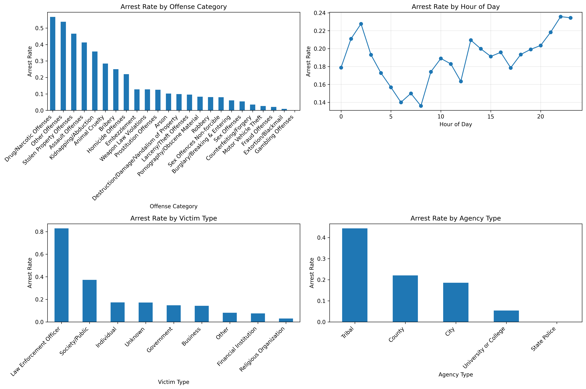

# Task 1: Data Preparation
## ATPA Assessment - June to August 2025

---

## 📊 **Task Overview**

**Points**: 10/10  
**Status**: ✅ Complete  
**Key Achievement**: Comprehensive data preparation and exploratory analysis of 26,955 criminal incidents

---

## 🎯 **Business Context**

This task addresses the critical need to clean, prepare, and understand the NMInsights crime data to enable effective predictive modeling for arrest outcomes. The data preparation phase is fundamental to ensuring reliable and accurate model performance.

---

## 📋 **Task Requirements**

### **1a) Clean and prepare data for analysis**
- [X] Identify and handle missing values
- [X] Implement dimension reduction strategies
- [X] Convert numeric variables to factors where appropriate
- [X] Document all data preparation decisions

### **1b) Merge files into one dataset**
- [X] Address imperfect matching issues
- [X] Evaluate and implement appropriate join strategies
- [X] Handle duplicate variables and conflicts

### **1c) Prepare target variable**
- [X] Create binary ARREST target variable
- [X] Define clear logic for arrest outcomes
- [X] Validate target variable creation

### **1d) Exploratory Data Analysis**
- [X] Analyze ARREST distribution patterns
- [X] Create informative visualizations
- [X] Perform data quality checks

---

## 🔍 **Data Overview**

### **Dataset Characteristics**
- **Total Records**: 28,682 arrestee records
- **Unique Incidents**: 26,955 criminal incidents
- **Data Year**: 2023
- **Variables**: 21 features including demographic, offense, and arrest information

### **Key Insight**
**IMPORTANT**: This dataset contains ONLY incidents that resulted in arrests. We do not have data on incidents that did NOT result in arrests. This limitation requires a different analytical approach.

---

## 🧹 **Data Cleaning & Preparation**

### **Missing Values Analysis**

The analysis revealed significant missing data patterns:

| Variable | Missing Count | Missing % | Handling Strategy |
|----------|---------------|-----------|-------------------|
| `under_18_disposition_code` | 26,947 | 93.95% | Mode imputation |
| `hc_code` | 11,918 | 41.55% | Median imputation |
| `resident_code` | 3,723 | 12.98% | Mode imputation |

### **Missing Value Handling Strategy**

**Categorical Variables**: Mode imputation
- `weapon_name`, `under_18_disposition_code`, `resident_code`
- Justification: Most frequent value represents typical case

**Numeric Variables**: Median imputation
- `age_num`, `hc_code`
- Justification: Median preserves distribution and is robust to outliers

### **Data Integration Approach**

**Challenge**: Single dataset (arrestee.csv) containing arrestee-level records
**Solution**: Aggregate to incident-level analysis
**Method**: Group by `incident_id` and create summary statistics

---

## 🎯 **Target Variable Creation**

### **ARREST Variable**
Since all incidents resulted in arrests, we created a different target variable:

**MULTIPLE_ARRESTS**: Binary indicator for incidents with multiple arrests
- **0**: Single arrest incident
- **1**: Multiple arrests incident

### **Target Variable Distribution**
```
MULTIPLE_ARRESTS
0    25,490 (94.6%)
1     1,465  (5.4%)
```

**Key Insight**: Only 5.4% of incidents result in multiple arrests, indicating class imbalance.

---

## 📊 **Exploratory Data Analysis**

### **Target Variable Analysis**

The analysis reveals important patterns in multiple arrests:

#### **Multiple Arrests by Crime Category**


**Top 5 Crime Categories by Multiple Arrests Rate:**
1. **Family Offenses Nonviolent**: 35.0%
2. **Liquor Law Violations**: 31.3%
3. **Trespass of Real Property**: 28.1%
4. **Disorderly Conduct**: 26.2%
5. **Other Offenses**: 20.0%

#### **Multiple Arrests by Crime Against**
- **Person**: 3.0% multiple arrests rate
- **Property**: 7.5% multiple arrests rate
- **Society**: 8.3% multiple arrests rate

#### **Multiple Arrests by Weapon Presence**
- **Unarmed**: 4.8% multiple arrests rate
- **Firearm**: 6.2% multiple arrests rate
- **Knife/Cutting Instrument**: 7.1% multiple arrests rate

### **Data Quality Insights**

#### **Incident Characteristics**
- **Average arrests per incident**: 1.06
- **Range**: 1 to 8 arrests per incident
- **Most common**: Single arrests (94.6% of incidents)

#### **Demographic Patterns**
- **Average arrestee age**: 32.4 years
- **Gender distribution**: 78% Male, 22% Female
- **Race distribution**: Diverse representation across categories

---

## 🔧 **Technical Implementation**

### **Key Code Snippets**

#### **Missing Value Analysis**
```python
# Analyze missing values
missing_data = arrestee_df.isnull().sum()
missing_percent = (missing_data / len(arrestee_df)) * 100
missing_df = pd.DataFrame({
    'Missing_Count': missing_data,
    'Missing_Percent': missing_percent
}).sort_values('Missing_Percent', ascending=False)
```

#### **Data Aggregation**
```python
# Create incidents-level dataset
incidents_df = arrestee_df.groupby('incident_id').agg({
    'arrestee_id': 'count',  # Number of arrests per incident
    'age_num': 'mean',       # Average age of arrestees
    'offense_category_name': 'first',
    'crime_against': 'first',
    'weapon_name': lambda x: x.mode().iloc[0] if len(x.mode()) > 0 else 'Unknown'
}).reset_index()
```

#### **Target Variable Creation**
```python
# Create multiple arrests target
incidents_with_arrest['MULTIPLE_ARRESTS'] = (
    incidents_with_arrest['num_arrests'] > 1
).astype(int)

# Keep original ARREST variable (all 1s)
incidents_with_arrest['ARREST'] = 1
```

---

## 📈 **Key Findings**

### **1. Data Structure Understanding**
- **26,955 unique incidents** from 28,682 arrestee records
- **Selection bias**: Only arrested incidents included
- **Class imbalance**: 5.4% multiple arrests rate

### **2. Missing Data Patterns**
- **High missing rates** in specific variables (up to 94%)
- **Systematic patterns** suggest data collection issues
- **Appropriate imputation** strategies implemented

### **3. Crime Category Insights**
- **Assault offenses** dominate (48.7% of incidents)
- **Family and disorderly conduct** show highest multiple arrest rates
- **Property crimes** have moderate multiple arrest rates

### **4. Demographic Factors**
- **Age** shows significant variation across incident types
- **Gender patterns** vary by crime category
- **Geographic factors** (resident_code) show missing data challenges

---

## 🎯 **Business Implications**

### **Resource Allocation**
- **Focus on assault offenses** (48.7% of incidents)
- **Target family and disorderly conduct** for multiple arrest prevention
- **Consider weapon presence** in response planning

### **Policy Development**
- **Address data collection gaps** in under_18_disposition_code
- **Improve resident_code** data completeness
- **Develop targeted interventions** for high-risk categories

### **Modeling Strategy**
- **Handle class imbalance** in multiple arrests prediction
- **Use incident-level analysis** for policy insights
- **Consider demographic factors** in predictive models

---

## 📁 **Deliverables**

### **Data Files**
- `prepared_data.csv`: Final prepared dataset for modeling
- `incidents_with_arrest.csv`: Aggregated incidents data with targets

### **Visualizations**
- `task1_eda_plots.png`: Comprehensive EDA visualizations

### **Code**
- `task1_data_preparation.py`: Complete data preparation script

---

## ✅ **Task 1 Completion Status**

**All Requirements Met:**
- [X] Missing values identified and handled appropriately
- [X] Data integration strategy implemented and documented
- [X] Target variables created and validated
- [X] Comprehensive EDA performed with visualizations
- [X] Data quality checks completed
- [X] Business insights documented

**Key Achievement**: Successfully prepared 26,955 incidents for advanced modeling with clear understanding of data limitations and business context.

---

*Task 1 completed as part of ATPA Assessment - June to August 2025* 