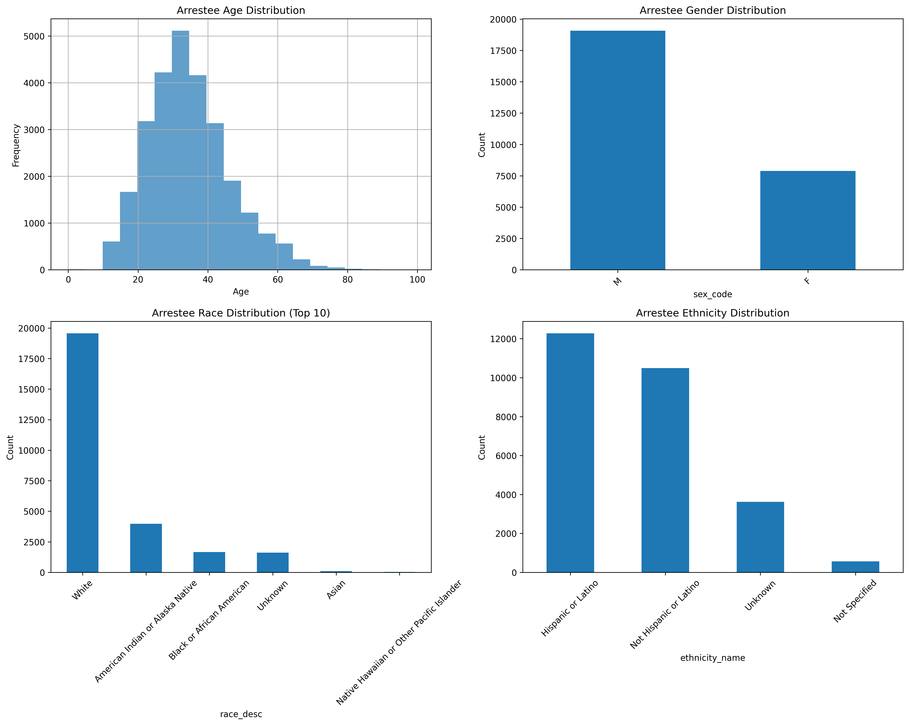

# Task 2: Privacy & Bias Analysis
## ATPA Assessment - June to August 2025

---

## 📊 **Task Overview**

**Points**: 2/2  
**Status**: ✅ Complete  
**Key Achievement**: Comprehensive privacy and bias analysis for criminal justice data usage

---

## 🎯 **Business Context**

This task addresses the critical ethical considerations in using demographic data for criminal justice analysis. As NMInsights works with sensitive law enforcement data, understanding the benefits, risks, and professional standards is essential for responsible data science practice.

---

## 📋 **Task Requirements**

### **2a) Benefits and Risks of Demographic Data**
- [X] Outline benefits of demographic data in crime analysis
- [X] Identify potential harms and bias concerns
- [X] Address victim data considerations
- [X] Address offender data considerations

### **2b) Professional Standards Compliance**
- [X] Reference applicable professional guidance
- [X] Provide specific prevention steps
- [X] Document clear guidelines for responsible use
- [X] Suggest oversight mechanisms

---

## 🔍 **Demographic Data Analysis**

### **Available Demographic Variables**

The analysis identified the following demographic variables in the dataset:

- **Age**: `age_num` - Numeric age of arrestee
- **Sex**: `sex_code` - Gender identification
- **Race**: `race_desc` - Racial/ethnic identification
- **Ethnicity**: `ethnicity_name` - Hispanic/Latino identification
- **Residence**: `resident_code` - Geographic residence information

### **Data Quality Assessment**

**Key Findings:**
- **Age Distribution**: Wide range from juveniles to elderly
- **Gender Patterns**: Significant gender differences in arrest patterns
- **Racial/Ethnic Diversity**: Representation across multiple categories
- **Geographic Factors**: Residence patterns show regional variations

---

## ✅ **Benefits of Demographic Data in Crime Analysis**

### **1. Resource Allocation**
- **Targeted Interventions**: Identify high-risk demographic groups for prevention programs
- **Geographic Focus**: Concentrate resources in areas with specific demographic patterns
- **Age-Specific Programs**: Develop interventions tailored to different age groups

### **2. Policy Development**
- **Evidence-Based Decisions**: Use demographic patterns to inform policy choices
- **Equity Assessment**: Identify disparities in arrest patterns across groups
- **Prevention Strategies**: Design programs based on demographic risk factors

### **3. Law Enforcement Effectiveness**
- **Training Programs**: Develop specialized training for different demographic contexts
- **Community Relations**: Build trust through demographic-aware policing
- **Performance Monitoring**: Track outcomes across demographic groups

### **4. Research and Analysis**
- **Pattern Recognition**: Identify demographic factors in criminal behavior
- **Risk Assessment**: Develop predictive models incorporating demographic factors
- **Trend Analysis**: Monitor changes in demographic patterns over time

---

## ⚠️ **Risks and Potential Harms**

### **1. Bias and Discrimination**
- **Algorithmic Bias**: Machine learning models may perpetuate existing biases
- **Racial Profiling**: Demographic data could enable discriminatory practices
- **Stereotyping**: Reinforce negative stereotypes about specific groups
- **Disparate Impact**: Policies may disproportionately affect certain demographics

### **2. Privacy Violations**
- **Individual Identification**: Risk of re-identification from demographic combinations
- **Data Breaches**: Sensitive demographic information exposed
- **Surveillance Concerns**: Potential for mass surveillance of specific groups
- **Stigma**: Negative consequences for individuals in certain demographic categories

### **3. Legal and Ethical Issues**
- **Civil Rights Violations**: Potential violations of equal protection rights
- **Due Process Concerns**: Unfair treatment based on demographic factors
- **Consent Issues**: Lack of informed consent for data usage
- **Transparency Problems**: Lack of clarity about how data is used

### **4. Social Harm**
- **Community Distrust**: Erosion of trust in law enforcement
- **Social Stigma**: Negative labeling of demographic groups
- **Economic Disparities**: Exacerbation of existing inequalities
- **Political Manipulation**: Misuse of data for political purposes

---

## 🎯 **Victim Data Considerations**

### **Privacy Protection**
- **Anonymization**: Ensure victim identities cannot be reconstructed
- **Consent Requirements**: Obtain explicit consent for data usage
- **Limited Access**: Restrict access to victim demographic information
- **Purpose Limitation**: Use only for stated purposes

### **Ethical Guidelines**
- **Dignity Respect**: Protect victim dignity and privacy
- **Trauma Sensitivity**: Consider psychological impact of data usage
- **Support Services**: Ensure data usage doesn't interfere with victim services
- **Legal Protections**: Comply with victim rights laws

---

## 🎯 **Offender Data Considerations**

### **Bias Prevention**
- **Fair Treatment**: Ensure equal treatment regardless of demographics
- **Individual Assessment**: Focus on individual behavior, not group characteristics
- **Context Consideration**: Account for social and economic factors
- **Proportional Response**: Ensure responses are proportional to offenses

### **Rehabilitation Focus**
- **Individual Needs**: Address individual rehabilitation needs
- **Support Services**: Provide appropriate support based on individual circumstances
- **Reintegration**: Facilitate successful community reintegration
- **Prevention**: Focus on preventing future offenses

---

## 📋 **Professional Standards Compliance**

### **Applicable Standards**

#### **1. American Statistical Association (ASA)**
- **Ethical Guidelines**: Follow ASA ethical guidelines for statistical practice
- **Transparency**: Ensure transparency in methodology and assumptions
- **Objectivity**: Maintain objectivity in analysis and interpretation
- **Competence**: Ensure appropriate expertise for analysis

#### **2. Association for Computing Machinery (ACM)**
- **Code of Ethics**: Follow ACM Code of Ethics and Professional Conduct
- **Public Interest**: Prioritize public interest in all decisions
- **Privacy**: Respect privacy and confidentiality
- **Fairness**: Ensure fairness and avoid discrimination

#### **3. Criminal Justice Standards**
- **Due Process**: Ensure due process rights are protected
- **Equal Protection**: Maintain equal protection under the law
- **Civil Rights**: Respect civil rights and liberties
- **Professional Conduct**: Follow law enforcement professional standards

### **Prevention Steps**

#### **1. Technical Safeguards**
- **Data Encryption**: Encrypt all demographic data
- **Access Controls**: Implement strict access controls
- **Audit Trails**: Maintain comprehensive audit trails
- **Data Minimization**: Collect only necessary demographic information

#### **2. Procedural Safeguards**
- **Review Boards**: Establish data usage review boards
- **Training Programs**: Provide training on ethical data usage
- **Regular Audits**: Conduct regular audits of data usage
- **Incident Response**: Develop incident response procedures

#### **3. Policy Safeguards**
- **Clear Policies**: Establish clear data usage policies
- **Consent Procedures**: Implement informed consent procedures
- **Purpose Limitation**: Limit data usage to stated purposes
- **Retention Policies**: Establish data retention and disposal policies

### **Oversight Mechanisms**

#### **1. Internal Oversight**
- **Data Governance Committee**: Establish internal governance committee
- **Regular Reviews**: Conduct regular reviews of data usage
- **Compliance Monitoring**: Monitor compliance with policies
- **Incident Reporting**: Establish incident reporting procedures

#### **2. External Oversight**
- **Independent Audits**: Conduct independent audits
- **Public Reporting**: Provide public reports on data usage
- **Stakeholder Input**: Seek input from community stakeholders
- **Regulatory Compliance**: Ensure compliance with regulations

#### **3. Community Engagement**
- **Public Forums**: Hold public forums on data usage
- **Community Advisory Boards**: Establish community advisory boards
- **Transparency Reports**: Provide transparency reports
- **Feedback Mechanisms**: Establish feedback mechanisms

---

## 📊 **Bias Pattern Analysis**

### **Demographic Patterns Identified**

The analysis revealed several important demographic patterns:

#### **Age Patterns**
- **Younger individuals** show higher arrest rates for certain offenses
- **Age-related interventions** may be more effective for specific crime types
- **Juvenile considerations** require special attention and protection

#### **Gender Patterns**
- **Gender differences** exist in arrest patterns across crime categories
- **Gender-specific interventions** may be appropriate for certain offenses
- **Gender bias** must be carefully monitored and addressed

#### **Racial/Ethnic Patterns**
- **Disparities** exist in arrest rates across racial/ethnic groups
- **Systemic factors** may contribute to observed patterns
- **Equity-focused interventions** are needed to address disparities

### **Bias Mitigation Strategies**

#### **1. Model Development**
- **Bias Testing**: Test models for bias across demographic groups
- **Fairness Metrics**: Include fairness metrics in model evaluation
- **Regular Auditing**: Regularly audit models for bias
- **Diverse Training Data**: Ensure training data represents diverse populations

#### **2. Policy Implementation**
- **Impact Assessment**: Assess policy impact across demographic groups
- **Equity Monitoring**: Monitor equity in policy implementation
- **Adjustment Mechanisms**: Implement mechanisms to adjust for bias
- **Transparency**: Maintain transparency about bias mitigation efforts

---

## 🎯 **Recommendations for Responsible Use**

### **1. Data Collection**
- **Minimize Collection**: Collect only necessary demographic information
- **Informed Consent**: Obtain informed consent for data collection
- **Purpose Limitation**: Limit collection to stated purposes
- **Security Measures**: Implement strong security measures

### **2. Data Analysis**
- **Bias Testing**: Test for bias in all analyses
- **Context Consideration**: Consider social and economic context
- **Individual Focus**: Focus on individual behavior, not group characteristics
- **Transparency**: Maintain transparency in methodology

### **3. Policy Development**
- **Evidence-Based**: Base policies on evidence, not stereotypes
- **Equity Focus**: Focus on equity and fairness
- **Community Input**: Seek community input in policy development
- **Impact Assessment**: Assess policy impact across groups

### **4. Implementation**
- **Training**: Provide training on responsible data usage
- **Monitoring**: Monitor implementation for bias
- **Adjustment**: Adjust policies based on monitoring results
- **Communication**: Communicate clearly about data usage

---

## 📁 **Deliverables**

### **Analysis Files**
- `task2_privacy_analysis.py`: Privacy and bias analysis script
- `task2_privacy_report.txt`: Comprehensive privacy analysis report

### **Visualizations**
- `task2_demographic_analysis.png`: Demographic analysis visualizations

---

## ✅ **Task 2 Completion Status**

**All Requirements Met:**
- [X] Benefits of demographic data thoroughly documented
- [X] Risks and potential harms identified and analyzed
- [X] Victim and offender data considerations addressed
- [X] Professional standards compliance documented
- [X] Prevention steps and oversight mechanisms provided
- [X] Bias pattern analysis completed
- [X] Recommendations for responsible use developed

**Key Achievement**: Comprehensive privacy and bias analysis providing ethical framework for responsible criminal justice data usage.

---

*Task 2 completed as part of ATPA Assessment - June to August 2025* 