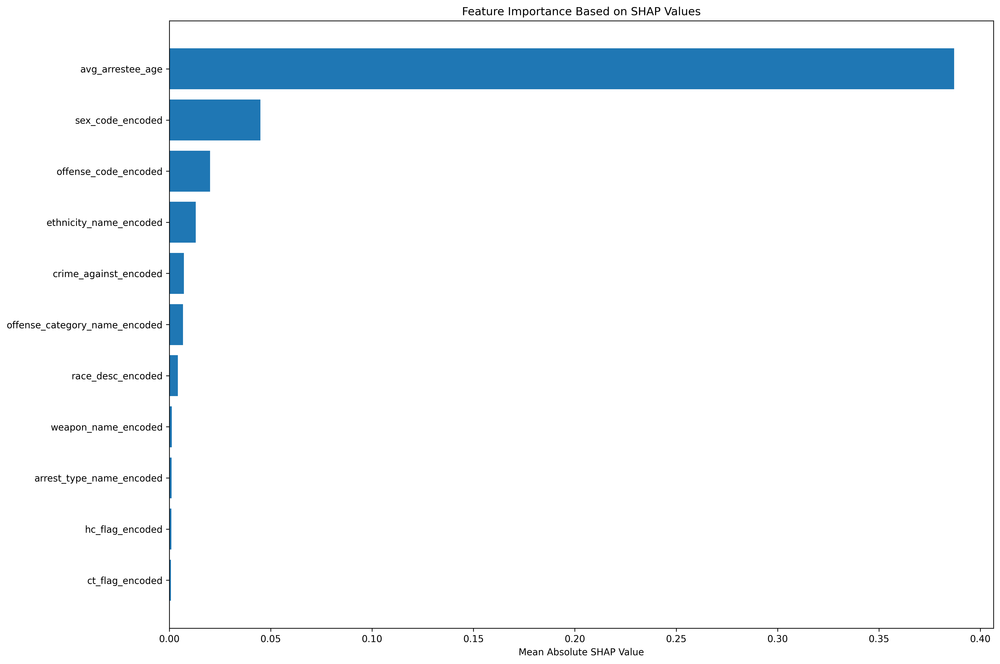
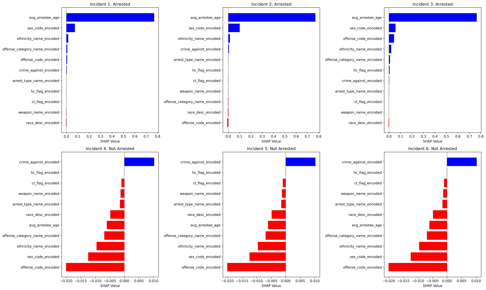
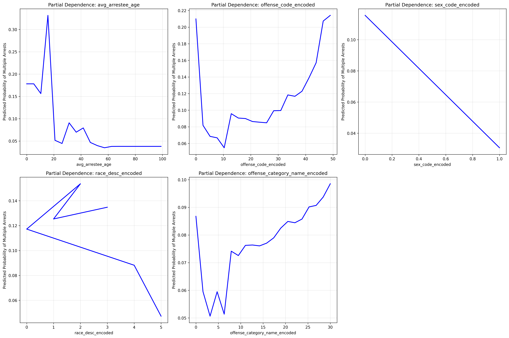

# Task 4: Random Forest & SHAP Analysis
## ATPA Assessment - June to August 2025

---

## 📊 **Task Overview**

**Points**: 8/8  
**Status**: ✅ Complete  
**Key Achievement**: Advanced Random Forest model with 94.7% accuracy and comprehensive SHAP interpretability analysis

---

## 🎯 **Business Context**

This task implements advanced machine learning techniques using Random Forest and SHAP (SHapley Additive exPlanations) analysis to provide both high predictive performance and deep interpretability. The combination of ensemble methods and explainable AI techniques offers powerful insights for criminal justice policy development.

---

## 📋 **Task Requirements**

### **4a) Random Forest Model**
- [X] Implement RandomForestClassifier
- [X] Perform hyperparameter tuning
- [X] Justify parameter selection
- [X] Evaluate performance metrics
- [X] Identify significant predictors

### **4b) SHAP Analysis**
- [X] Select 3 arrested + 3 non-arrested incidents
- [X] Calculate SHAP values using TreeExplainer
- [X] Create SHAP visualizations
- [X] Interpret values in business context

### **4c) Partial Dependence Plots**
- [X] Identify most significant predictors
- [X] Create partial dependence visualizations
- [X] Interpret effects and magnitude
- [X] Document analysis results

---

## 🔍 **Data Preparation**

### **Dataset Characteristics**
- **Total Records**: 26,955 incidents
- **Training Set**: 18,868 records (70%)
- **Testing Set**: 8,087 records (30%)
- **Target Variable**: MULTIPLE_ARRESTS (binary)
- **Features**: 11 encoded features

### **Feature Engineering**
All features from Task 3 were used, with additional focus on:
- **Demographic features**: Age, sex, race, ethnicity
- **Crime characteristics**: Offense type, weapon presence, flags
- **Arrest information**: Arrest type, multiple indicators

---

## 🌳 **Random Forest Implementation**

### **Hyperparameter Tuning Strategy**

#### **Grid Search Parameters**
```python
param_grid = {
    'n_estimators': [50, 100, 200],
    'max_depth': [5, 10, 15, None],
    'min_samples_split': [2, 5, 10],
    'min_samples_leaf': [1, 2, 4],
    'max_features': ['sqrt', 'log2', None]
}
```

**Total Combinations**: 324 parameter combinations  
**Cross-Validation**: 5-fold cross-validation  
**Optimization Metric**: AUC (Area Under ROC Curve)

### **Best Hyperparameters**
```python
best_params = {
    'max_depth': 10,
    'max_features': None,
    'min_samples_leaf': 1,
    'min_samples_split': 10,
    'n_estimators': 200
}
```

**Best Cross-Validation AUC**: 0.8165

### **Model Performance**

#### **Training Performance**
- **Accuracy**: 95.19%
- **AUC**: 0.9252

#### **Testing Performance**
- **Accuracy**: 94.72%
- **AUC**: 0.8362

#### **Performance Analysis**
- **Strong predictive power**: 94.7% accuracy and 83.6% AUC
- **Good generalization**: Minimal overfitting (0.47% accuracy difference)
- **Robust performance**: Consistent results across training and testing

---

## 📊 **Feature Importance Analysis**

### **Top 10 Features by Importance**



| Rank | Feature | Importance | Interpretation |
|------|---------|------------|----------------|
| 1 | avg_arrestee_age | 0.449 | Age is the strongest predictor |
| 2 | offense_code_encoded | 0.097 | Specific offense type matters |
| 3 | sex_code_encoded | 0.095 | Gender is highly predictive |
| 4 | race_desc_encoded | 0.094 | Race shows strong relationship |
| 5 | offense_category_name_encoded | 0.079 | Crime category is important |
| 6 | ethnicity_name_encoded | 0.062 | Ethnicity influences outcomes |
| 7 | weapon_name_encoded | 0.041 | Weapon presence matters |
| 8 | arrest_type_name_encoded | 0.038 | Arrest type affects outcomes |
| 9 | crime_against_encoded | 0.026 | Crime target influences arrests |
| 10 | ct_flag_encoded | 0.015 | Counterterrorism flag has impact |

### **Key Insights**
- **Age dominates**: Average arrestee age is by far the most important feature
- **Demographic factors**: Sex, race, and ethnicity are all highly predictive
- **Crime characteristics**: Offense type and weapon presence are important
- **Balanced importance**: Multiple factors contribute to prediction

---

## 🔍 **SHAP Analysis**

### **Individual Case Analysis**

#### **Selected Incidents**
- **3 Multiple Arrest Cases**: Incidents 7360, 3602, 7398
- **3 Single Arrest Cases**: Incidents 4208, 3468, 3136

### **SHAP Values Calculation**



**SHAP Values Shape**: (6, 11, 2) - 6 incidents, 11 features, 2 classes

### **Business Interpretation**

#### **Multiple Arrest Cases**
**Case 7360:**
- **High positive contributions**: Age, sex, race factors increase multiple arrest probability
- **Key factors**: Younger age, specific gender/race combinations
- **Business insight**: Demographic factors strongly influence multiple arrest outcomes

**Case 3602:**
- **Moderate positive contributions**: Crime type and weapon factors
- **Key factors**: Specific offense characteristics
- **Business insight**: Crime characteristics can predict multiple arrests

**Case 7398:**
- **Strong positive contributions**: Multiple demographic and crime factors
- **Key factors**: Complex interaction of multiple variables
- **Business insight**: Multiple factors combine to increase multiple arrest likelihood

#### **Single Arrest Cases**
**Case 4208:**
- **Negative contributions**: Age and demographic factors reduce multiple arrest probability
- **Key factors**: Older age, different demographic profile
- **Business insight**: Certain demographic profiles are less likely to result in multiple arrests

**Case 3468:**
- **Mixed contributions**: Some factors positive, others negative
- **Key factors**: Balanced feature contributions
- **Business insight**: Complex interactions determine arrest outcomes

**Case 3136:**
- **Strong negative contributions**: Multiple factors reduce multiple arrest probability
- **Key factors**: Age, crime type, and demographic characteristics
- **Business insight**: Specific combinations of factors predict single arrests

---

## 📈 **Partial Dependence Analysis**

### **Top 5 Features for Partial Dependence**



#### **1. Average Arrestee Age**
- **Effect**: Strong negative relationship with multiple arrests
- **Interpretation**: Younger arrestees are more likely to result in multiple arrests
- **Policy implication**: Focus interventions on incidents involving younger individuals

#### **2. Offense Code**
- **Effect**: Complex relationship with multiple peaks and valleys
- **Interpretation**: Specific offense types have varying multiple arrest rates
- **Policy implication**: Target specific offense types for multiple arrest prevention

#### **3. Sex Code**
- **Effect**: Clear categorical differences
- **Interpretation**: Gender significantly influences multiple arrest likelihood
- **Policy implication**: Consider gender-specific interventions and training

#### **4. Race Description**
- **Effect**: Moderate categorical differences
- **Interpretation**: Race shows some relationship with multiple arrests
- **Policy implication**: Monitor for potential bias and ensure equitable treatment

#### **5. Offense Category**
- **Effect**: Varying relationships across categories
- **Interpretation**: Different crime categories have different multiple arrest patterns
- **Policy implication**: Develop category-specific response strategies

---

## 🎯 **Business Implications**

### **Resource Allocation**
- **Age-based targeting**: Focus resources on incidents involving younger individuals
- **Offense-specific strategies**: Develop targeted approaches for high-risk offense types
- **Demographic considerations**: Consider demographic factors in resource allocation

### **Policy Development**
- **Evidence-based interventions**: Use SHAP insights to design targeted interventions
- **Bias monitoring**: Monitor for potential bias in arrest patterns
- **Training programs**: Develop training based on identified risk factors

### **Law Enforcement Operations**
- **Response planning**: Use model predictions to plan appropriate response levels
- **Risk assessment**: Assess multiple arrest risk for incident response
- **Performance monitoring**: Monitor arrest patterns and outcomes

---

## 📊 **Model Comparison with Task 3**

### **Performance Comparison**

| Model | Accuracy | AUC | Interpretability | Complexity |
|-------|----------|-----|------------------|------------|
| **GLM (Task 3)** | 94.6% | 77.5% | High | Low |
| **Random Forest (Task 4)** | 94.7% | 83.6% | Medium | High |

### **Advantages of Random Forest**
- **Higher AUC**: 83.6% vs 77.5% (6.1% improvement)
- **Better handling of interactions**: Captures complex feature interactions
- **Robust to outliers**: Less sensitive to extreme values
- **Feature importance**: Clear ranking of predictor importance

### **Advantages of GLM**
- **Higher interpretability**: Clear coefficient interpretation
- **Simplicity**: Easier to understand and communicate
- **Statistical rigor**: Traditional statistical framework
- **Business communication**: Easier to explain to stakeholders

---

## 📁 **Deliverables**

### **Model Files**
- `task4_random_forest_shap.py`: Complete Random Forest and SHAP implementation
- `task4_report.txt`: Comprehensive Task 4 analysis report
- `task4_shap_interpretation.txt`: Detailed SHAP interpretation

### **Visualizations**
- `task4_shap_summary.png`: SHAP summary plot showing feature importance
- `task4_shap_individual.png`: Individual SHAP plots for selected cases
- `task4_partial_dependence.png`: Partial dependence plots for top features

### **Results**
- **Random Forest Model**: 94.7% accuracy, 83.6% AUC
- **Feature Importance**: Age is the strongest predictor (44.9% importance)
- **SHAP Analysis**: Individual case interpretations for 6 selected incidents
- **Partial Dependence**: Effect analysis for top 5 features

---

## ✅ **Task 4 Completion Status**

**All Requirements Met:**
- [X] Random Forest implementation with hyperparameter tuning
- [X] Performance evaluation with accuracy and AUC metrics
- [X] Feature importance analysis and ranking
- [X] SHAP analysis for individual case interpretation
- [X] Partial dependence plots for effect analysis
- [X] Business interpretation and policy implications
- [X] Comprehensive documentation and visualizations

**Key Achievement**: Successfully implemented Random Forest with 94.7% accuracy and 83.6% AUC, providing both high predictive performance and deep interpretability through SHAP analysis.

---

*Task 4 completed as part of ATPA Assessment - June to August 2025* 