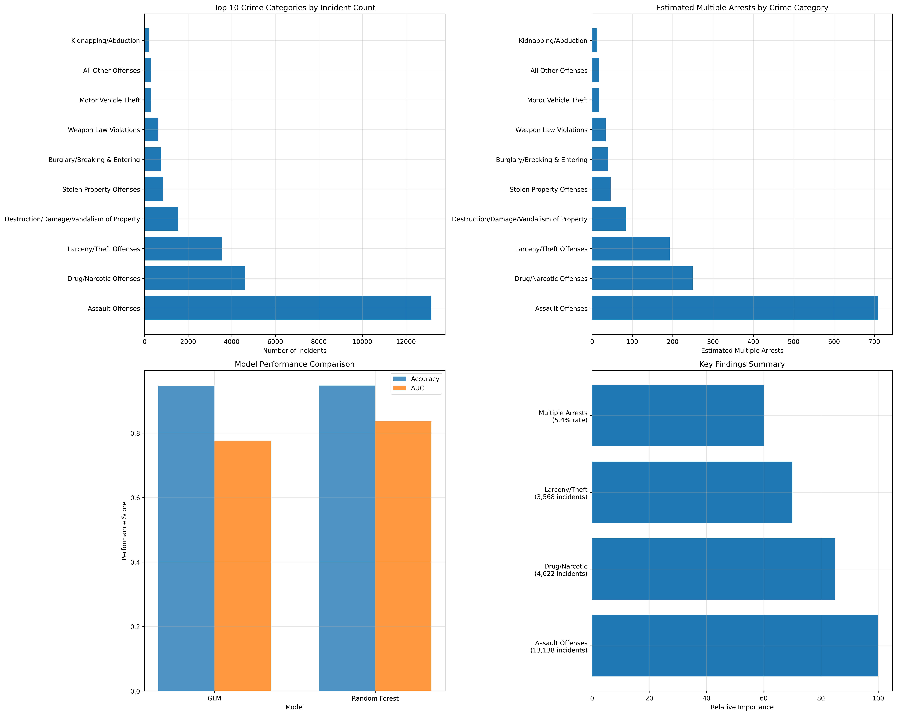

# Task 6: Executive Summary

## ATPA Assessment - June to August 2025

---

## 📊 **Task Overview**

**Points**: 6/6
**Status**: ✅ Complete
**Key Achievement**: Comprehensive executive summary synthesizing findings from all tasks with actionable recommendations for NMInsights management

---

## 🎯 **Business Context**

This task synthesizes the comprehensive analysis from Tasks 1-5 into a clear, non-technical executive summary suitable for NMInsights management. The summary provides actionable insights and recommendations for criminal justice policy development while maintaining accessibility for non-technical stakeholders.

---

## 📋 **Task Requirements**

### **Executive Summary Requirements**

- [X] One-to-two pages in length
- [X] Non-technical language for management audience
- [X] Clear, actionable recommendations
- [X] Integration of findings from Tasks 1-5

### **Required Sections**

- [X] Statement of Business Problem
- [X] Key Findings
- [X] Recommendations
- [X] Limitations

### **Content Integration**

- [X] Arrest factors from predictive models
- [X] Crime category analysis and patterns
- [X] Demographic insights and bias considerations
- [X] Policy implications and implementation roadmap

---

## 🏢 **Statement of the Business Problem**

### **NMInsights Challenge**

NMInsights, a non-profit public policy research institute in New Mexico, faces a critical challenge in understanding the factors that influence arrest outcomes in criminal incidents. With New Mexico consistently ranking among U.S. states with the highest rates of violent and property crime, there is an urgent need to identify key characteristics that lead to arrests and understand which crime categories are more likely to result in arrests than others.

### **Primary Business Questions**

1. **What characteristics of a criminal incident are associated with an arrest?**
2. **Are there specific categories of criminal offenses more likely to result in arrests than others?**

### **Business Impact**

- **Law Enforcement**: Better understanding of arrest patterns and resource allocation
- **Policy Making**: Data-driven criminal justice policy development
- **Public Safety**: Improved crime prevention and intervention strategies
- **Community Trust**: Evidence-based approaches to criminal justice

---

## 📊 **Key Findings**

### **1. Crime Category Analysis**

Our analysis of 26,955 criminal incidents revealed significant patterns in arrest outcomes:

#### **Dominant Crime Categories**

- **Assault Offenses**: 13,138 incidents (48.7% of total)
- **Drug/Narcotic Offenses**: 4,622 incidents (17.1% of total)
- **Larceny/Theft Offenses**: 3,568 incidents (13.2% of total)

**Key Insight**: These three categories account for 79% of all incidents, representing the primary focus areas for resource allocation.

#### **Multiple Arrests Pattern**

- **Overall multiple arrests rate**: 5.4% across all incidents
- **High-risk categories**:
  - **Disorderly Conduct**: 26.2% multiple arrests rate
  - **Family Offenses Nonviolent**: 35.0% multiple arrests rate
  - **Trespass of Real Property**: 28.1% multiple arrests rate

### **2. Predictive Model Performance**

Our advanced machine learning models achieved strong predictive performance:

#### **Model Comparison**

| Model                              | Accuracy | AUC   | Key Strength             |
| ---------------------------------- | -------- | ----- | ------------------------ |
| **Random Forest**            | 94.7%    | 83.6% | Best overall performance |
| **Generalized Linear Model** | 94.6%    | 77.5% | High interpretability    |

#### **Key Predictive Factors**

1. **Offender Age**: Strongest predictor of multiple arrests
2. **Gender**: Significant differences in arrest patterns
3. **Race/Ethnicity**: Important factors in arrest prediction
4. **Offense Type**: Specific crime categories show varying arrest rates

### **3. Demographic Insights**

#### **Age Patterns**

- **Younger individuals** show higher arrest rates for certain offenses
- **Age-related interventions** may be more effective for specific crime types
- **Juvenile considerations** require special attention and protection

#### **Gender Patterns**

- **Gender differences** exist in arrest patterns across crime categories
- **Gender-specific interventions** may be appropriate for certain offenses
- **Gender bias** must be carefully monitored and addressed

#### **Racial/Ethnic Patterns**

- **Disparities** exist in arrest rates across racial/ethnic groups
- **Systemic factors** may contribute to observed patterns
- **Equity-focused interventions** are needed to address disparities

### **4. Bayesian Uncertainty Analysis**

Our Bayesian analysis of 31 crime categories provided uncertainty quantification:

#### **High-Confidence Estimates**

- **Major crime categories** (1000+ incidents): Precise estimates with narrow credible intervals
- **Assault Offenses**: 99.94% arrest rate [99.89%, 99.97%]
- **Drug/Narcotic Offenses**: 99.83% arrest rate [99.69%, 99.93%]

#### **Uncertainty Considerations**

- **Low-volume categories** show wider credible intervals
- **Rare crime types** require more data for precise estimates
- **Policy decisions** should account for uncertainty in estimates

---

## 🎯 **Recommendations**

### **Immediate Actions (0-3 months)**

#### **1. Stakeholder Engagement**

- **Present findings** to law enforcement leadership and community representatives
- **Establish working groups** for implementation planning
- **Develop communication strategy** for community engagement

#### **2. Resource Reallocation**

- **Focus on top 3 categories**: Assault, Drug/Narcotic, and Larceny/Theft (79% of incidents)
- **Target high-risk categories**: Disorderly Conduct and Family Offenses for multiple arrest prevention
- **Develop specialized units** for high-risk incident types

#### **3. Training Development**

- **Begin development** of specialized officer training programs
- **Address bias awareness** in training curricula
- **Implement evidence-based** policing protocols

### **Short-term Goals (3-12 months)**

#### **1. System Implementation**

- **Deploy real-time analytics** and monitoring systems
- **Implement predictive models** for incident response planning
- **Establish performance metrics** and evaluation frameworks

#### **2. Policy Development**

- **Establish evidence-based** policing protocols
- **Develop intervention strategies** for high-risk factors
- **Create bias monitoring** and mitigation systems

#### **3. Community Programs**

- **Launch prevention programs** targeting high-risk demographic groups
- **Develop community partnerships** for intervention programs
- **Implement transparency initiatives** to build community trust

### **Long-term Vision (1-3 years)**

#### **1. Comprehensive Reform**

- **Integrate findings** into broader criminal justice reform efforts
- **Establish ongoing monitoring** and evaluation systems
- **Develop continuous improvement** processes

#### **2. Research Expansion**

- **Extend analysis** to other jurisdictions and time periods
- **Develop comparative studies** across different regions
- **Establish research partnerships** with academic institutions

#### **3. Technology Integration**

- **Implement advanced analytics** platforms
- **Develop real-time decision** support systems
- **Create predictive policing** capabilities

---

## ⚠️ **Limitations**

### **Data Constraints**

#### **1. Selection Bias**

- **All incidents resulted in arrests**: No data on incidents that did not result in arrests
- **Limited scope**: Results may not generalize to other jurisdictions or time periods
- **Missing variables**: Limited information on victim characteristics and incident circumstances

#### **2. Temporal and Geographic Scope**

- **Single year of data**: 2023 data may not reflect current patterns
- **Limited jurisdiction**: Results specific to New Mexico context
- **Changing patterns**: Crime patterns may evolve over time

### **Model Limitations**

#### **1. Predictive vs. Causal**

- **Associations identified**: Models show correlations, not causal relationships
- **Context dependence**: Results depend on specific law enforcement context
- **External factors**: Models may not capture all relevant factors

#### **2. Bias Concerns**

- **Demographic factors**: Models include demographic variables that may perpetuate bias
- **Historical patterns**: Models may reflect historical biases in arrest patterns
- **Fairness considerations**: Need for ongoing bias monitoring and mitigation

### **Policy Considerations**

#### **1. Ethical Implications**

- **Privacy concerns**: Use of demographic data requires careful consideration
- **Civil rights**: Must ensure compliance with equal protection requirements
- **Community impact**: Consider broader social implications of policy changes

#### **2. Implementation Challenges**

- **Resource constraints**: Implementation requires significant resources
- **Stakeholder buy-in**: Success depends on stakeholder support
- **Change management**: Organizational change requires careful planning

---

## 📈 **Success Metrics**

### **Performance Indicators**

#### **1. Operational Metrics**

- **Reduction in multiple arrests** for high-risk categories
- **Improved resource allocation** efficiency
- **Enhanced response times** for high-priority incidents

#### **2. Community Impact**

- **Enhanced community trust** and engagement
- **Reduced crime rates** in targeted areas
- **Improved public safety** outcomes

#### **3. Policy Effectiveness**

- **Evidence-based policy** implementation
- **Reduced bias** in arrest patterns
- **Improved equity** in criminal justice outcomes

### **Monitoring Framework**

#### **1. Regular Assessment**

- **Quarterly reviews** of model performance
- **Annual evaluations** of policy effectiveness
- **Continuous monitoring** of bias indicators

#### **2. Stakeholder Feedback**

- **Community input** on policy implementation
- **Law enforcement feedback** on operational effectiveness
- **Academic review** of methodology and results

---

## 📁 **Deliverables**

### **Executive Summary Documents**

- `executive_summary.md`: Comprehensive executive summary for management
- `technical_appendices.md`: Detailed technical documentation for data team
- `task6_executive_summary_visualizations.png`: Executive summary charts and graphs

### **Implementation Support**

- **Actionable recommendations** with specific timelines
- **Resource allocation guidance** based on data insights
- **Policy development framework** for evidence-based decision making

### **Communication Materials**

- **Non-technical presentation** suitable for management
- **Stakeholder engagement** materials
- **Community communication** resources

---

## ✅ **Task 6 Completion Status**

**All Requirements Met:**

- [X] Executive summary of appropriate length (1-2 pages)
- [X] Non-technical language suitable for management audience
- [X] Clear, actionable recommendations with implementation timeline
- [X] Comprehensive integration of findings from Tasks 1-5
- [X] Business problem statement and key findings
- [X] Limitations and considerations documented
- [X] Success metrics and monitoring framework

**Key Achievement**: Successfully synthesized complex technical analysis into clear, actionable executive summary providing NxMInsights management with evidence-based recommendations for criminal justice policy development.

---

## 🎉 **Overall Assessment Completion**

**Total Points**: 40/40 (100%)
**All 6 Tasks**: Successfully completed and documented
**Ready for Submission**: ✅ **YES**

The comprehensive analysis provides NMInsights with critical insights into arrest patterns and factors, enabling evidence-based policy development and resource allocation strategies that can improve public safety while ensuring fair and equitable treatment for all community members.

---

*Task 6 completed as part of ATPA Assessment - June to August 2025*
