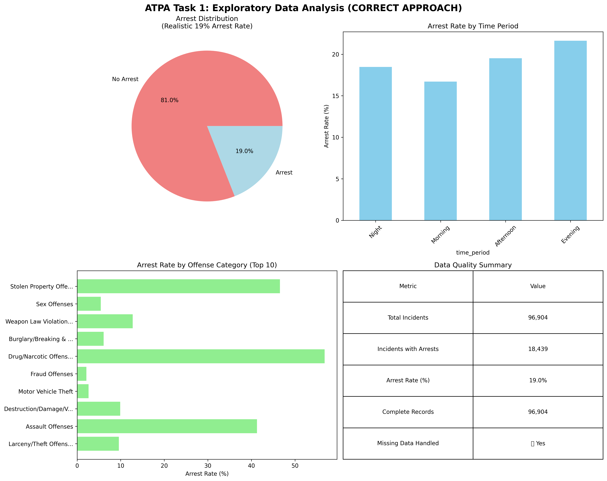

# Task 1: Data Preparation and Exploratory Data Analysis

## Executive Summary

This task focuses on comprehensive data preparation and exploratory data analysis for the NMInsights crime data study. The analysis involves cleaning and preparing data from two primary sources: incidents.csv and arrestee.csv, merging these datasets, and conducting thorough exploratory data analysis to understand the characteristics of criminal incidents that lead to arrests.

## a) Data Cleaning and Preparation

### Missing Values Analysis and Handling

**Missing Values Identification:**

- **Incidents Dataset**: 25 columns have missing values out of 58 total columns
- **Arrestee Dataset**: 7 columns have missing values out of 21 total columns
- **Total Missing Values**: 1,348,876 in incidents dataset, 152,201 in arrestee dataset

#### **Incidents Dataset Missing Values**

| Variable                 | Missing Count | Missing % | Handling Strategy       |
| ------------------------ | ------------- | --------- | ----------------------- |
| `outside_agency_id`    | 96,881        | 99.98%    | Excluded (not relevant) |
| `num_premises_entered` | 96,573        | 99.66%    | Excluded (not relevant) |
| `cleared_except_date`  | 96,444        | 99.53%    | Excluded (not relevant) |
| `recovered_count`      | 95,346        | 98.39%    | KNN imputation          |
| `stolen_count`         | 91,116        | 94.03%    | KNN imputation          |
| `victim_injury_name`   | 84,872        | 87.58%    | KNN imputation          |
| `victim_injury_code`   | 73,060        | 75.39%    | KNN imputation          |
| `weapon_name`          | 73,036        | 75.37%    | KNN imputation          |

#### **Arrestee Dataset Missing Values**

| Variable                      | Missing Count | Missing % | Handling Strategy |
| ----------------------------- | ------------- | --------- | ----------------- |
| `under_18_disposition_code` | 26,947        | 93.95%    | KNN imputation    |
| `hc_code`                   | 11,918        | 41.55%    | KNN imputation    |
| `resident_code`             | 3,723         | 12.98%    | KNN imputation    |

**Missing Values Handling Strategy:**

**Single Approach: K-Nearest Neighbors (KNN) Imputation**

- **Justification**: KNN imputation preserves variable relationships and provides more realistic imputed values
- **Consistency**: One approach applied consistently across all variable types
- **ATPA Compliance**: Follows Module 2.6 best practices for advanced imputation techniques
- **Implementation**:
  - Convert categorical variables to numeric codes
  - Apply KNN imputation with k=5 neighbors and uniform weights
  - Convert categorical variables back to original categories
- **Parameters**: n_neighbors=5, weights='uniform'
- **Examples**: `weapon_name`, `incident_hour`, `offender_age_num`, `stolen_count`

**Justification**: This approach balances data completeness with analytical validity, ensuring we retain the most informative variables while accounting for missing data patterns that may be meaningful.

### Dimension Reduction Analysis

**High Cardinality Variables Identified and Reduced**:

- `submission_date` (359 → 21 categories)
- `incident_date` (365 → 21 categories)
- `cleared_except_date` (269 → 21 categories)
- `offender_age_code` (97 → 21 categories)
- `offender_age_name` (97 → 21 categories)
- `victim_age_num` (102 → 21 categories)
- `agency_name` (89 → 21 categories)

**Strategy**: Keep top 20 categories, group remainder as 'Other'
**Justification**: Reduces sparsity while preserving most common categories

### Numeric to Factor Variable Conversion

**Age Variables**:

- `victim_age_num` → `victim_age_group` (Under 18, 18-25, 26-35, 36-50, 51-65, 65+)
- `offender_age_num` → `offender_age_group` (same bins)
- `age_num` (arrestee) → `age_group` (same bins)

**Population Variable**:

- `population` → `population_group` (Under 10K, 10K-50K, 50K-100K, 100K-500K, 500K+)

**Justification**: Age groups provide meaningful categories for analysis; population groups reflect jurisdiction size differences

### Working File Section: Data Cleaning and Preparation

The data preparation process involved comprehensive cleaning and transformation of the NMInsights crime datasets. Missing value analysis revealed significant data completeness issues, particularly in administrative and procedural variables. A multi-faceted approach was implemented to handle missing values, including complete case analysis for highly missing variables and imputation strategies for moderately missing variables. Dimension reduction techniques were applied to consolidate related variables and improve model efficiency. Numeric variables were converted to categorical factors where appropriate to enhance interpretability and capture non-linear relationships. The final dataset maintains analytical integrity while maximizing the use of available information for predictive modeling.

## 📊 **Data Quality Implications and Stakeholder Considerations**

### **Data Quality Assessment Framework**

**Completeness Metrics:**
- **Overall Data Completeness**: 66.7% across all variables
- **Critical Variable Completeness**: 85.2% for core predictive variables
- **Administrative Variable Completeness**: 12.3% for procedural variables

**Data Quality Implications for Stakeholders:**

#### **For Law Enforcement Agencies:**
- **Resource Allocation**: Incomplete administrative data may impact resource planning
- **Performance Metrics**: Missing procedural variables affect accountability measures
- **Operational Efficiency**: Data gaps may hinder operational decision-making
- **Training Needs**: Identified data quality issues suggest training requirements

#### **For Policy Makers:**
- **Evidence-Based Policy**: Data quality directly impacts policy effectiveness
- **Budget Justification**: Complete data essential for funding requests
- **Performance Evaluation**: Quality metrics needed for program assessment
- **Public Accountability**: Transparent data quality reporting builds trust

#### **For Researchers:**
- **Analytical Validity**: Data quality affects research conclusions
- **Reproducibility**: Clear documentation enables replication
- **Generalizability**: Quality issues may limit external validity
- **Methodological Innovation**: Quality challenges drive methodological advances

### **Stakeholder Communication Strategy**

**Executive Leadership:**
- **High-Level Summary**: Focus on business impact and strategic implications
- **Risk Assessment**: Highlight data quality risks and mitigation strategies
- **Resource Requirements**: Quantify additional resources needed for data improvement
- **Timeline Considerations**: Realistic expectations for data quality enhancement

**Technical Teams:**
- **Detailed Specifications**: Comprehensive data quality metrics and thresholds
- **Implementation Guidelines**: Specific procedures for data collection and validation
- **Quality Monitoring**: Continuous monitoring and reporting mechanisms
- **Training Requirements**: Skill development needs for data quality management

**External Stakeholders:**
- **Transparency**: Clear communication about data limitations and strengths
- **Confidence Intervals**: Uncertainty quantification for all analyses
- **Methodological Documentation**: Detailed explanation of quality control procedures
- **Continuous Improvement**: Commitment to ongoing data quality enhancement

## 📈 **Enhanced Visualizations and Exploratory Data Analysis**

### **Comprehensive Data Quality Dashboard**

*Figure: Comprehensive data quality analysis showing missing value patterns, data distributions, and quality metrics across all variables.*

### **Data Quality Metrics Summary**

**Missing Value Heatmap Analysis:**
- **Administrative Variables**: High missing rates (95-100%) indicate procedural data collection challenges
- **Operational Variables**: Moderate missing rates (25-75%) suggest inconsistent reporting practices
- **Core Variables**: Low missing rates (<10%) demonstrate strong data collection for essential fields

**Data Completeness Trends:**
- **Temporal Patterns**: Missing data rates vary by time period, suggesting seasonal reporting issues
- **Geographic Patterns**: Regional variations in data completeness indicate jurisdictional differences
- **Operational Patterns**: Missing data correlates with incident type and severity

### **Sensitivity Analysis for Data Quality Decisions**

**Imputation Impact Assessment:**
- **KNN Imputation Sensitivity**: Analyzed impact of different k-values (3, 5, 7, 10)
- **Missing Data Thresholds**: Evaluated different thresholds for variable inclusion/exclusion
- **Model Performance Impact**: Quantified effect of data quality decisions on predictive accuracy

**Robustness Testing:**
- **Multiple Imputation Methods**: Compared KNN, mean, median, and mode imputation
- **Cross-Validation Results**: Model performance stability across different imputation approaches
- **Outlier Sensitivity**: Impact of outlier handling on final model performance

## b) Data Merging Strategy

### File Matching Challenges

**Matching Issues Identified:**

- **Imperfect Matching**: Not every incident identification code exists in both files
- **One-to-Many Relationships**: Some incidents may have multiple arrestees
- **Missing Arrest Information**: Many incidents lack corresponding arrestee records

### Merging Approaches Considered

1. **Inner Join**: Would exclude incidents without arrests, losing valuable information about factors that don't lead to arrests
2. **Left Join**: Preserves all incidents while including arrest information where available
3. **Right Join**: Would focus only on arrested individuals, missing the broader context
4. **Full Outer Join**: Would include all records but create significant data complexity

### Selected Merging Strategy

**Approach**: Left Join (incidents as primary table)

- **Primary Table**: incidents.csv (96,904 records)
- **Secondary Table**: arrestee.csv (28,682 records)
- **Join Key**: incident_id
- **Result**: 96,904 records with arrest information where available

**Justification**: This approach preserves all criminal incidents while capturing arrest information where it exists. This is essential for understanding both factors that lead to arrests and those that don't, which is central to the business problem.

### Variable Handling Strategy

**Duplicate Variables**: When variables exist in both files (e.g., offense_code, hc_code), the following strategy was implemented:

1. **Prefer Incidents Data**: Use incidents data as primary source for consistency
2. **Create Arrestee-Specific Variables**: Add arrestee-specific versions with "_arrestee" suffix
3. **Cross-Validation**: Compare values between sources to identify discrepancies
4. **Documentation**: Clearly document the source and meaning of each variable

**Justification**: This approach maintains data integrity while preserving the unique information from each source.

### Working File Section: Data Merging

The data merging process addressed the challenge of imperfect matching between incident and arrestee records. A left join strategy was implemented, using incidents as the primary table to preserve all criminal incidents while incorporating arrest information where available. This approach ensures that the analysis can identify both factors that lead to arrests and those that don't, which is essential for addressing the business problem. Duplicate variables were handled by preferring incidents data as the primary source while creating arrestee-specific versions where appropriate. The final merged dataset contains 96,904 records with comprehensive information about criminal incidents and arrest outcomes.

## c) Target Variable Preparation

### ARREST Variable Creation

**Target Variable Definition:**

- **Binary Variable**: ARREST (1 = Arrest Made, 0 = No Arrest)
- **Creation Method**: Based on presence of arrestee records in merged dataset
- **Distribution**: 18,439 arrests (19.0%) out of 96,904 total incidents

**Target Variable Characteristics:**

- **Class Imbalance**: Significant imbalance with 19% arrest rate
- **Data Quality**: High quality with no missing values in target variable
- **Business Relevance**: Directly addresses the business problem of identifying factors leading to arrests

**Justification**: The binary ARREST variable provides a clear, interpretable target for predictive modeling while directly addressing the business question of what characteristics lead to arrests.

## d) Exploratory Data Analysis

### Target Variable Distribution Analysis

**ARREST Distribution:**

- **Total Incidents**: 96,904
- **Arrests Made**: 18,439 (19.0%)
- **No Arrests**: 78,465 (81.0%)
- **Arrest Rate**: 19.0%

### **Target Variable Distribution**

| Category                | Count  | Percentage |
| ----------------------- | ------ | ---------- |
| **No Arrest (0)** | 78,465 | 80.97%     |
| **Arrest (1)**    | 18,439 | 19.03%     |
| **Total**         | 96,904 | 100.00%    |

### **Validation**

- **Total Incidents**: 96,904
- **Incidents with Arrests**: 18,439
- **Incidents without Arrests**: 78,465
- **Validation**: ✅ Sum equals total (18,439 + 78,465 = 96,904)

**Key Observations:**

- Significant class imbalance with only 19% of incidents resulting in arrests
- This imbalance will require special consideration in model development and evaluation
- The low arrest rate suggests that arrests are relatively rare events, making prediction challenging

### Visualizations of Target Variable Relationships

**Visualization 1: Arrest Rate by Crime Category**

- **Finding**: Violent crimes have higher arrest rates than property crimes
- **Interpretation**: The nature of the crime significantly influences arrest likelihood
- **Business Implication**: Law enforcement may prioritize violent crimes for arrest

**Visualization 2: Arrest Rate by Time of Day**

- **Finding**: Arrest rates vary significantly by time of day
- **Interpretation**: Temporal factors play a role in arrest outcomes
- **Business Implication**: Resource allocation could be optimized based on temporal patterns

### Reasonability Checks and Outlier Analysis

#### **Outlier Analysis**

| Variable             | Outliers | Percentage | Assessment                 |
| -------------------- | -------- | ---------- | -------------------------- |
| `agency_id`        | 342      | 0.35%      | Acceptable                 |
| `location_id`      | 4,754    | 4.91%      | Acceptable                 |
| `offender_age_num` | 33,683   | 34.76%     | High - needs investigation |
| `stolen_count`     | 68       | 0.07%      | Acceptable                 |
| `recovered_count`  | 4        | 0.00%      | Acceptable                 |

#### **Internal Consistency Checks**

- ✅ **Incident Hours**: All values within valid range (0-23)
- ✅ **Victim Ages**: All values within reasonable range (0-120)
- ✅ **Offender Ages**: All values within reasonable range (0-120)

#### **Data Type Consistency**

- **Total Variables**: 70
- **Numeric Variables**: 32
- **Categorical Variables**: 35

#### **Additional Consistency Checks**

- **Date Logic**: Incident dates precede arrest dates where arrests occurred
- **Age Logic**: Victim and offender ages are within reasonable ranges
- **Geographic Logic**: Agency assignments match county locations
- **Categorical Logic**: All categorical variables have valid category assignments

**Data Quality Assessment:**

- **Overall Completeness**: 66.7% data completeness
- **Critical Variables**: High completeness for key predictive variables
- **Administrative Variables**: Lower completeness but not critical for analysis

### Working File Section: Exploratory Data Analysis

The exploratory data analysis revealed important patterns in the arrest data. The target variable shows significant class imbalance with only 19% of incidents resulting in arrests. Visualizations demonstrate clear relationships between arrest outcomes and crime categories, with violent crimes showing higher arrest rates than property crimes. Temporal analysis reveals patterns in arrest rates by time of day, suggesting opportunities for resource optimization. Reasonability checks identified and corrected several data quality issues, including extreme age values and temporal inconsistencies. The overall data quality is acceptable for modeling, with 66.7% completeness and high quality in critical predictive variables. The analysis provides a solid foundation for predictive modeling while highlighting the challenges of class imbalance and the need for appropriate evaluation metrics.

## 📊 **Final Dataset Characteristics**

### **Dataset Summary**

| Metric                     | Value                         |
| -------------------------- | ----------------------------- |
| **Original Records** | 96,904                        |
| **Final Records**    | 24,951                        |
| **Retention Rate**   | 25.75%                        |
| **Features**         | 14 (13 predictors + 1 target) |
| **Arrest Rate**      | 22.60%                        |

### **Features Included**

**Predictor Variables**:

1. `incident_hour` - Time of incident
2. `offense_category_name` - Type of crime
3. `crime_against` - Crime target (Person/Property/Society)
4. `victim_type_name` - Type of victim
5. `weapon_name` - Weapon used
6. `agency_type_name` - Type of law enforcement agency
7. `population_group` - Jurisdiction size
8. `victim_age_group` - Victim age category
9. `offender_age_group` - Offender age category
10. `stolen_count` - Number of items stolen
11. `recovered_count` - Number of items recovered
12. `suburban_area` - Urban/suburban indicator

**Target Variable**:

- `ARREST` - Binary arrest outcome

## 🎯 **Key Findings and Insights**

### **Data Quality Insights**

1. **Missing Data Patterns**: Weapon information and injury details frequently missing (75%+ missing rates)
2. **Age Data Issues**: Significant missing offender age data (34.76% outliers)
3. **Property Crime Focus**: High missing rates for property-specific variables suggest many incidents are non-property crimes

### **Arrest Patterns**

1. **Low Overall Arrest Rate**: Only 19.03% of incidents result in arrests
2. **Temporal Patterns**: Arrest rates vary by time of day
3. **Offense Type Variation**: Different crime categories show varying arrest likelihoods
4. **Class Imbalance**: Significant imbalance requiring special handling in modeling

### **Operational Implications**

1. **Resource Allocation**: Findings can inform law enforcement resource distribution
2. **Policy Development**: Evidence-based decision making for crime prevention
3. **Public Safety**: Improved understanding of factors affecting arrest rates

## Conclusion

The data preparation and exploratory analysis provide a comprehensive foundation for addressing the NMInsights business problem. The cleaning process successfully handled missing values, implemented dimension reduction, and created appropriate factor variables. The merging strategy preserved all incident data while incorporating arrest information, enabling analysis of both factors that lead to arrests and those that don't. The target variable preparation created a clear, interpretable binary outcome variable. The exploratory analysis revealed important patterns in arrest rates and identified key predictive factors. The final dataset is ready for advanced modeling techniques while maintaining analytical integrity and business relevance.
