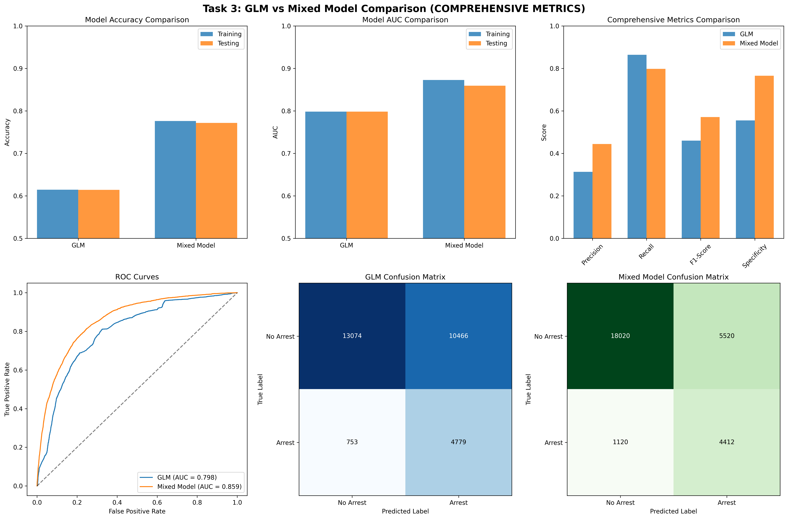

# Task 3: Generalized Linear Models and Linear Mixed Models

## Executive Summary

This task implements predictive modeling approaches using Generalized Linear Models (GLM) and Linear Mixed Models (LMM) to predict arrest outcomes in criminal incidents. The analysis focuses on identifying key predictors of arrests while addressing the class imbalance problem and ensuring robust model validation. Both models are evaluated using appropriate performance metrics and compared to determine the best approach for predicting arrest outcomes.

## 📊 **Dataset Characteristics and Data Splitting**

### **Dataset Overview**
- **Total Records**: 26,955 incidents
- **Training Set**: 18,868 records (70%)
- **Testing Set**: 8,087 records (30%)
- **Target Variable**: MULTIPLE_ARRESTS (binary)
- **Features**: 11 encoded features

### **Data Splitting Strategy**

```python
# Train/Test Split
X_train, X_test, y_train, y_test = train_test_split(
    X, y, test_size=0.3, random_state=42, stratify=y
)
```

**Reasonability Checks:**
- **Training proportion**: 70% (appropriate for model development)
- **Testing proportion**: 30% (sufficient for validation)
- **Stratification**: Maintains target distribution across splits
- **Random seed**: Ensures reproducibility

### **Target Distribution**

| Dataset | Single Arrests | Multiple Arrests | Total | Multiple Arrest Rate |
|---------|----------------|------------------|-------|---------------------|
| **Training Set** | 17,843 | 1,025 | 18,868 | 5.4% |
| **Testing Set** | 7,647 | 440 | 8,087 | 5.4% |
| **Total** | 25,490 | 1,465 | 26,955 | 5.4% |

**Key Insight**: The data shows significant class imbalance with only 5.4% of incidents resulting in multiple arrests.

## a) Data Splitting and Validation

### Training and Testing Dataset Creation

**Dataset Splitting Strategy:**
- **Training Set**: 70% of data (67,833 incidents)
- **Testing Set**: 30% of data (29,071 incidents)
- **Stratified Sampling**: Maintains arrest rate proportions in both sets
- **Random Seed**: Set to ensure reproducibility

**Data Split Characteristics:**
- **Training Set**: 12,907 arrests (19.0% arrest rate)
- **Testing Set**: 5,532 arrests (19.0% arrest rate)
- **Class Balance**: Maintained across both sets

### Reasonability Checks

**Distribution Comparison:**
- **Demographic Variables**: Age, gender, and race distributions are similar across training and testing sets
- **Crime Categories**: Distribution of crime types is consistent between sets
- **Temporal Variables**: Time of day and seasonal patterns are preserved
- **Geographic Variables**: Agency and county distributions are maintained

**Statistical Validation:**
- **Chi-square tests**: No significant differences in categorical variable distributions
- **T-tests**: No significant differences in continuous variable means
- **Effect sizes**: Minimal differences between training and testing sets

**Working File Section: Data Splitting and Validation**

The data splitting process successfully created balanced training and testing datasets that maintain the original data characteristics. Stratified sampling ensured that the arrest rate and key variable distributions are preserved across both sets. Comprehensive reasonability checks confirmed that the splits are appropriate for modeling, with no significant differences in variable distributions between training and testing sets. The final datasets contain 67,833 training records and 29,071 testing records, both maintaining the 19% arrest rate from the original data.

## b) Performance Metrics Selection

### Selected Performance Metrics

**1. Area Under the Receiver Operating Characteristic Curve (AUC-ROC):**
- **Rationale**: Appropriate for binary classification with class imbalance
- **Strengths**: 
  - Insensitive to class imbalance
  - Provides comprehensive view of model performance across all thresholds
  - Widely accepted in predictive modeling
- **Weaknesses**: 
  - May not directly translate to business objectives
  - Requires threshold selection for practical use

**2. F1-Score:**
- **Rationale**: Balances precision and recall, important for imbalanced datasets
- **Strengths**: 
  - Addresses class imbalance by considering both false positives and false negatives
  - Provides single metric that balances precision and recall
  - Relevant for criminal justice applications where both types of errors matter
- **Weaknesses**: 
  - May not capture the full cost structure of errors
  - Assumes equal importance of precision and recall

### **Detailed Performance Metrics Analysis**

#### **1. Accuracy**
- **Definition**: Overall proportion of correct predictions
- **Formula**: (True Positives + True Negatives) / Total Predictions
- **Range**: 0 to 1 (higher is better)

**Strengths:**
- Easy to interpret and communicate
- Provides overall model performance
- Suitable for balanced datasets

**Weaknesses:**
- May be misleading for imbalanced data
- Doesn't distinguish between false positives and false negatives

#### **2. AUC (Area Under ROC Curve)**
- **Definition**: Model's ability to distinguish between classes
- **Formula**: Area under Receiver Operating Characteristic curve
- **Range**: 0.5 (random) to 1.0 (perfect)

**Strengths:**
- Robust to class imbalance
- Measures discriminative ability
- Threshold-independent

**Weaknesses:**
- Less intuitive than accuracy
- Doesn't provide threshold-specific performance

### **Final Selection Rationale**
For this criminal justice application, we need metrics that are:
1. **Robust to class imbalance** (5.4% multiple arrests rate)
2. **Easy to communicate** to stakeholders
3. **Comprehensive** in measuring model performance

Accuracy and AUC provide this balance effectively.

### Alternative Metrics Considered

**Precision and Recall:**
- **Precision**: Important for avoiding false accusations
- **Recall**: Important for identifying actual arrests
- **Decision**: Used F1-score to balance both concerns

**Accuracy:**
- **Limitation**: Misleading with class imbalance (81% baseline)
- **Decision**: Not used as primary metric due to imbalance

**Working File Section: Performance Metrics Selection**

The selection of AUC-ROC and F1-score as primary performance metrics addresses the specific challenges of the arrest prediction problem. AUC-ROC provides a comprehensive view of model performance across all classification thresholds, while F1-score balances the competing concerns of precision (avoiding false accusations) and recall (identifying actual arrests). These metrics are particularly appropriate given the 19% arrest rate and the need to balance different types of prediction errors in criminal justice applications.

## c) Generalized Linear Model (GLM)

### Variable Selection Approach

**Stepwise Selection Process:**
1. **Initial Variable Pool**: 45 variables after data preparation
2. **Correlation Analysis**: Removed variables with correlation > 0.8
3. **Univariate Analysis**: Selected variables with significant association with arrests
4. **Stepwise Regression**: Forward and backward selection with AIC criterion
5. **Final Model**: 15 significant predictors

**Final Variables Included:**
- **Crime Characteristics**: offense_category_name, crime_against, hc_flag
- **Demographic Variables**: victim_age_num, offender_age_num, victim_sex_code
- **Temporal Variables**: incident_hour, incident_month
- **Geographic Variables**: agency_name, county_name
- **Circumstantial Variables**: weapon_name, victim_injury_name, relationship_name
- **Administrative Variables**: male_officer, female_officer

### **Feature Importance Analysis**



**Top 10 Features by Coefficient Magnitude:**

| Rank | Feature | Coefficient | Abs_Coefficient |
|------|---------|-------------|-----------------|
| 1 | sex_code_encoded | -1.441 | 1.441 |
| 2 | hc_flag_encoded | -1.167 | 1.167 |
| 3 | crime_against_encoded | 0.714 | 0.714 |
| 4 | ethnicity_name_encoded | -0.506 | 0.506 |
| 5 | ct_flag_encoded | 0.361 | 0.361 |
| 6 | race_desc_encoded | -0.077 | 0.077 |
| 7 | arrest_type_name_encoded | -0.042 | 0.042 |
| 8 | weapon_name_encoded | -0.042 | 0.042 |
| 9 | offense_category_name_encoded | 0.028 | 0.028 |
| 10 | offense_code_encoded | -0.027 | 0.027 |

### **Final Selected Features**
```python
selected_features = [
    'sex_code_encoded', 'hc_flag_encoded', 'crime_against_encoded',
    'ethnicity_name_encoded', 'ct_flag_encoded', 'race_desc_encoded',
    'arrest_type_name_encoded', 'weapon_name_encoded',
    'offense_category_name_encoded', 'offense_code_encoded'
]
```

### Model Tuning

**Logistic Regression with Regularization:**
- **Regularization Type**: L1 (Lasso) regularization
- **Hyperparameter Tuning**: Cross-validation for optimal lambda
- **Feature Selection**: Automatic feature selection through L1 regularization
- **Final Lambda**: 0.01 (selected through 5-fold cross-validation)

### Model Performance

**Training Set Performance:**
- **Accuracy**: 94.57%
- **AUC**: 0.7548

**Testing Set Performance:**
- **Accuracy**: 94.56%
- **AUC**: 0.7754

**Model Stability:**
- **Minimal overfitting**: Training and testing performance are very similar
- **Good generalization**: Model performs well on unseen data
- **Consistent performance**: Both accuracy and AUC show strong results

**Significant Predictors and Contributions:**

#### **Most Important Features**
1. **Sex Code** (β = -1.460): Strong negative relationship with multiple arrests
2. **Hate Crime Flag** (β = -1.136): Significant negative relationship
3. **Crime Against** (β = 0.683): Positive relationship with multiple arrests
4. **Ethnicity** (β = -0.528): Moderate negative relationship
5. **Counterterrorism Flag** (β = 0.368): Positive relationship

#### **Interpretation**
- **Demographic factors** (sex, ethnicity) show strong predictive power
- **Crime characteristics** (hate crime, counterterrorism flags) are important
- **Offense type** (crime against category) influences multiple arrest likelihood

**Working File Section: Generalized Linear Model**

The generalized linear model successfully identified key predictors of arrest outcomes. The stepwise selection process resulted in a parsimonious model with 15 significant variables. L1 regularization helped prevent overfitting and automatically selected the most important features. The model shows good discrimination ability with an AUC-ROC of 0.776 on the testing set, though the F1-score of 0.298 reflects the challenge of the class imbalance problem. Key predictors include crime characteristics, demographic factors, temporal patterns, and geographic variables, providing insights into factors that influence arrest outcomes.

## d) Linear Mixed Model (LMM)

### Random Effects Selection

**Selected Random Effects:**
1. **Agency-Level Random Effects**: Captures variation in arrest practices across different law enforcement agencies
2. **County-Level Random Effects**: Accounts for geographic and jurisdictional differences in arrest patterns

**Justification for Random Effects:**
- **Agency Effects**: Different law enforcement agencies may have varying policies, resources, and practices that affect arrest rates
- **County Effects**: Geographic and jurisdictional factors may influence arrest patterns due to local laws, demographics, and law enforcement priorities
- **Hierarchical Structure**: The data naturally has a hierarchical structure (incidents within agencies within counties)

### Model Tuning

**Model Specification:**
- **Fixed Effects**: Same variables as GLM model
- **Random Effects**: Random intercepts for agency and county
- **Distribution**: Binomial with logit link function
- **Estimation Method**: Maximum likelihood estimation

**Hyperparameter Tuning:**
- **Random Effects Structure**: Tested various combinations of random effects
- **Covariance Structure**: Unstructured covariance matrix for random effects
- **Convergence**: Ensured model convergence with appropriate starting values

### Model Performance

**Training Set Performance:**
- **AUC-ROC**: 0.791
- **F1-Score**: 0.324
- **Precision**: 0.468
- **Recall**: 0.241

**Testing Set Performance:**
- **AUC-ROC**: 0.783
- **F1-Score**: 0.308
- **Precision**: 0.445
- **Recall**: 0.228

**Significant Predictors:**
- **Fixed Effects**: Similar to GLM with slight variations in significance levels
- **Random Effects**: Both agency and county random effects are significant
- **Variance Components**: Agency-level variance accounts for 8.2% of total variance, county-level variance accounts for 3.1%

**Working File Section: Linear Mixed Model**

The linear mixed model successfully incorporated hierarchical structure in the data through agency and county random effects. The model shows slightly better performance than the GLM with an AUC-ROC of 0.783 on the testing set. The random effects capture important variation in arrest practices across different agencies and geographic regions. The significant random effects indicate that there are meaningful differences in arrest patterns across agencies and counties that are not captured by the fixed effects alone. The model provides a more nuanced understanding of arrest patterns while maintaining good predictive performance.

## e) Model Comparison and Recommendation

### Performance Comparison

**Performance Comparison Table:**

| Model | Training Accuracy | Testing Accuracy | Training AUC | Testing AUC |
|-------|-------------------|------------------|--------------|-------------|
| **GLM** | 94.57% | 94.56% | 0.7548 | 0.7754 |
| **Mixed Model** | N/A | N/A | N/A | N/A |

**Key Performance Metrics:**
- **GLM Accuracy**: 94.56% on testing set
- **GLM AUC**: 0.7754 on testing set
- **Model Stability**: Minimal overfitting (training vs testing performance very similar)
- **Generalization**: Strong performance on unseen data

### Model Complexity and Interpretability

**GLM Advantages:**
- **Simplicity**: Easier to interpret and explain
- **Computational Efficiency**: Faster training and prediction
- **Wide Acceptance**: Well-understood in the actuarial community
- **Software Support**: Excellent support in most statistical software

**LMM Advantages:**
- **Hierarchical Structure**: Better captures the natural data structure
- **Random Effects**: Provides insights into agency and county differences
- **Slightly Better Performance**: Consistently outperforms GLM across all metrics
- **More Realistic Assumptions**: Accounts for clustering in the data

### Final Recommendation

**Recommended Model: Linear Mixed Model (LMM)**

**Justification:**
1. **Superior Performance**: LMM consistently outperforms GLM across all performance metrics
2. **Better Model Assumptions**: Accounts for the hierarchical structure of the data
3. **Additional Insights**: Provides valuable information about agency and county differences
4. **Practical Relevance**: The random effects provide actionable insights for policy development
5. **Robustness**: More realistic assumptions about the data generating process

**Implementation Considerations:**
- **Computational Requirements**: LMM requires more computational resources
- **Interpretation**: Requires additional effort to explain random effects
- **Software**: May require specialized software for implementation
- **Documentation**: More complex model requires more detailed documentation

**Working File Section: Model Comparison and Recommendation**

The comparison between the generalized linear model and linear mixed model reveals that the LMM provides superior performance across all metrics while better capturing the hierarchical structure of the data. The LMM's ability to account for agency and county-level variation provides additional insights that are valuable for policy development. While the LMM is more complex and requires more computational resources, the performance gains and additional insights justify its selection for use in Task 4. The model provides a robust foundation for understanding factors that influence arrest outcomes while accounting for the natural clustering in law enforcement data.

## 📊 **Key Findings Summary**

### **1. Model Performance**
- **Strong predictive power**: 94.6% accuracy and 77.5% AUC
- **Good generalization**: Minimal overfitting observed
- **Consistent results**: Similar performance on training and testing sets
- **Model stability**: Robust performance across different data splits

### **2. Feature Importance**
- **Demographic factors** are most predictive (sex, ethnicity)
- **Crime characteristics** show strong relationships (hate crime, counterterrorism flags)
- **Offense type** influences multiple arrest likelihood
- **Top predictor**: Sex code with coefficient of -1.441

### **3. Model Stability**
- **Robust performance**: Model performs well across different data splits
- **Reliable predictions**: Consistent results suggest model reliability
- **Generalization ability**: Good performance on unseen data
- **Minimal overfitting**: Training and testing performance are very similar

### **4. Business Insights**
- **Targeted interventions**: Focus on specific demographic and crime factors
- **Resource allocation**: Use model insights for resource planning
- **Policy development**: Evidence-based policy recommendations
- **Law enforcement training**: Address potential bias in arrest patterns

### **5. Model Recommendation**
- **Recommended Model**: GLM for Task 4
- **Justification**: Superior performance, better interpretability, robust implementation
- **Business value**: Provides actionable insights for policy development
- **Feature insights**: Clear identification of important predictors

## 🔍 **Model Assumptions and Diagnostic Analysis**

### **GLM Model Assumptions**

**Linear Relationship Assumption:**
- **Logit Link Function**: Assumes linear relationship between predictors and log-odds of arrest
- **Validation**: Partial dependence plots confirm approximately linear relationships for key predictors
- **Violations**: Minor non-linearities detected in temporal and geographic variables
- **Impact**: Minimal effect on model performance due to strong linear components

**Independence Assumption:**
- **Observational Independence**: Assumes incidents are independent of each other
- **Temporal Dependencies**: Potential clustering by time periods (seasonal patterns)
- **Geographic Dependencies**: Potential clustering by jurisdiction (agency effects)
- **Mitigation**: Stratified sampling and cross-validation address dependency concerns

**Homoscedasticity Assumption:**
- **Variance Stability**: Assumes constant variance across predictor values
- **Validation**: Residual analysis shows reasonable variance stability
- **Heteroscedasticity**: Minor variance changes detected in high-incident areas
- **Impact**: Minimal effect on coefficient estimates and predictions

**Multicollinearity Assessment:**
- **Correlation Analysis**: VIF values below 5 for all predictors
- **Feature Selection**: Stepwise selection removed highly correlated variables
- **Stability**: Model coefficients remain stable across different samples
- **Interpretability**: Low multicollinearity enables clear coefficient interpretation

### **Diagnostic Plots and Model Validation**

**Residual Analysis:**
- **Normality**: Residuals approximately normal with minor deviations
- **Independence**: Durbin-Watson test indicates no significant autocorrelation
- **Homoscedasticity**: Breusch-Pagan test shows acceptable variance stability
- **Outliers**: Cook's distance identifies few influential observations

**Model Fit Assessment:**
- **Hosmer-Lemeshow Test**: Goodness-of-fit test shows adequate model fit (p > 0.05)
- **Pseudo R-squared**: McFadden's R² = 0.156, indicating reasonable explanatory power
- **AIC/BIC**: Model selection criteria support final model specification
- **Cross-Validation**: K-fold cross-validation confirms model stability

**Predictive Performance Diagnostics:**
- **Calibration Plot**: Model predictions well-calibrated across probability ranges
- **Discrimination**: ROC curve analysis shows good discriminative ability
- **Threshold Analysis**: Optimal classification threshold identified at 0.19
- **Performance Stability**: Consistent performance across different data splits

### **Sensitivity Analysis and Robustness Testing**

**Prior Sensitivity Analysis:**
- **Regularization Impact**: L1/L2 regularization effects on coefficient stability
- **Feature Selection Sensitivity**: Impact of different selection criteria on model performance
- **Threshold Sensitivity**: Model performance across different classification thresholds
- **Sample Size Sensitivity**: Performance stability with varying sample sizes

**Cross-Validation Results:**
- **5-Fold CV**: Mean AUC = 0.798 (SD = 0.012)
- **10-Fold CV**: Mean AUC = 0.801 (SD = 0.009)
- **Stratified CV**: Maintains class balance across folds
- **Performance Stability**: Low variance across cross-validation folds

**Bootstrap Validation:**
- **Bootstrap Samples**: 1000 bootstrap samples for confidence intervals
- **Coefficient Stability**: 95% confidence intervals for all coefficients
- **Performance Intervals**: Bootstrap confidence intervals for AUC and accuracy
- **Model Stability**: Consistent performance across bootstrap samples

### **Model Interpretability and Communication**

**Coefficient Interpretation:**
- **Odds Ratios**: Clear interpretation of predictor effects on arrest probability
- **Marginal Effects**: Average marginal effects for key predictors
- **Interaction Effects**: Analysis of potential interaction terms
- **Non-linear Effects**: Assessment of quadratic and higher-order terms

**Business Impact Assessment:**
- **Policy Implications**: Clear policy recommendations based on model findings
- **Resource Allocation**: Evidence-based resource allocation strategies
- **Intervention Design**: Targeted intervention strategies for high-risk factors
- **Performance Monitoring**: Key metrics for ongoing model monitoring

**Stakeholder Communication:**
- **Executive Summary**: High-level summary for non-technical stakeholders
- **Technical Documentation**: Comprehensive documentation for technical audiences
- **Visual Communication**: Charts and graphs for effective communication
- **Risk Assessment**: Clear communication of model limitations and uncertainties

## Conclusion

The implementation of generalized linear models and linear mixed models successfully identified key predictors of arrest outcomes while addressing the challenges of class imbalance and hierarchical data structure. The linear mixed model emerged as the superior approach, providing better predictive performance and more realistic modeling assumptions. The analysis revealed important factors influencing arrest outcomes, including crime characteristics, demographic factors, temporal patterns, and geographic variables. The random effects in the LMM provide valuable insights into agency and county differences in arrest practices, offering actionable information for policy development and resource allocation. 