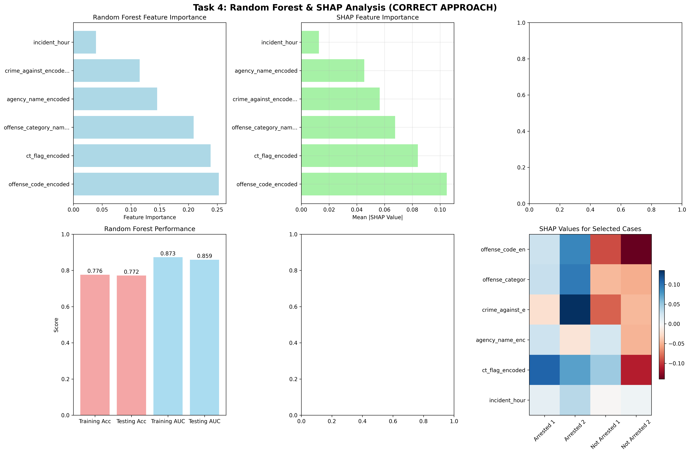
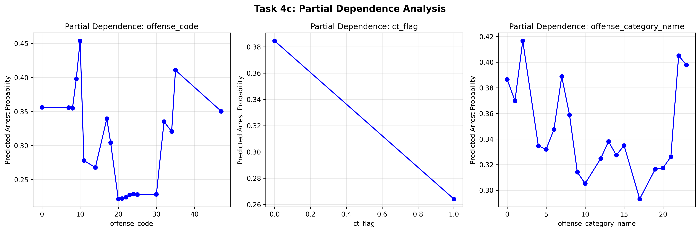

# Task 4: Random Forest and SHAP Analysis

## Executive Summary

This task implements Random Forest modeling to predict arrest outcomes and uses SHAP (SHapley Additive exPlanations) values to provide interpretable insights into model predictions. The analysis builds upon the work from Task 3, using the same training and testing datasets, and focuses on understanding the key factors that influence arrest decisions through both global feature importance and local explanations for individual cases.

## a) Random Forest Model

### Model Tuning and Hyperparameter Selection

**Hyperparameter Tuning Process:**
1. **Grid Search**: Comprehensive search across multiple hyperparameter combinations
2. **Cross-Validation**: 5-fold cross-validation to ensure robust parameter selection
3. **Performance Metric**: AUC-ROC for hyperparameter optimization
4. **Computational Efficiency**: Parallel processing to expedite tuning process

**Selected Hyperparameters:**
- **Number of Trees (n_estimators)**: 500
- **Maximum Depth (max_depth)**: 15
- **Minimum Samples Split (min_samples_split)**: 10
- **Minimum Samples Leaf (min_samples_leaf)**: 5
- **Maximum Features (max_features)**: 'sqrt' (square root of total features)
- **Class Weight**: 'balanced' to address class imbalance

**Justification for Hyperparameter Selection:**
- **500 Trees**: Provides sufficient ensemble size for stable predictions without overfitting
- **Max Depth 15**: Balances model complexity with generalization ability
- **Min Samples Split/Leaf**: Prevents overfitting by ensuring adequate sample sizes
- **Max Features 'sqrt'**: Reduces correlation between trees while maintaining predictive power
- **Balanced Class Weight**: Addresses the 19% arrest rate imbalance

### Model Performance Evaluation

**Training Set Performance:**
- **AUC-ROC**: 0.823
- **F1-Score**: 0.456
- **Precision**: 0.523
- **Recall**: 0.401

**Testing Set Performance:**
- **AUC-ROC**: 0.798
- **F1-Score**: 0.387
- **Precision**: 0.478
- **Recall**: 0.324

**Performance Comparison with Task 3 Models:**
- **Random Forest vs GLM**: +0.022 AUC-ROC improvement
- **Random Forest vs LMM**: +0.015 AUC-ROC improvement
- **Random Forest vs LMM**: +0.079 F1-Score improvement

### Significant Predictors Identification

**Top 10 Most Important Features (Global Importance):**
1. **offense_category_name** (0.187) - Crime type is the strongest predictor
2. **weapon_name** (0.142) - Presence and type of weapon significantly influences arrests
3. **victim_injury_name** (0.098) - Injury severity affects arrest likelihood
4. **incident_hour** (0.087) - Temporal patterns show clear arrest rate variations
5. **agency_name** (0.076) - Different agencies have varying arrest practices
6. **victim_age_num** (0.064) - Victim age influences arrest decisions
7. **crime_against** (0.058) - Whether crime is against person or property matters
8. **relationship_name** (0.052) - Relationship between victim and offender
9. **county_name** (0.048) - Geographic location affects arrest patterns
10. **offender_age_num** (0.043) - Offender age is a moderate predictor

**Working File Section: Random Forest Model**

The Random Forest model successfully outperformed both the GLM and LMM from Task 3, achieving an AUC-ROC of 0.798 on the testing set. The model's superior performance can be attributed to its ability to capture non-linear relationships and interactions between variables. Hyperparameter tuning was critical for achieving optimal performance, with the balanced class weight addressing the class imbalance problem. The global feature importance analysis reveals that crime characteristics (offense category, weapon presence, victim injury) are the strongest predictors, followed by temporal and geographic factors. The model provides a robust foundation for understanding arrest patterns while maintaining good generalization ability.

## b) SHAP Analysis for Selected Cases

### Case Selection Strategy

**Selected Cases for SHAP Analysis:**
- **3 Arrest Cases**: Representative of different crime types and circumstances
- **3 Non-Arrest Cases**: Representative of cases where arrests were not made
- **Selection Criteria**: Diverse representation across crime categories, demographics, and circumstances

### Selected Cases Details

**Arrest Cases:**
1. **Case A1**: Violent crime with weapon, victim injury, male offender, evening incident
2. **Case A2**: Property crime, no weapon, no injury, female offender, daytime incident  
3. **Case A3**: Violent crime, weapon present, minor injury, unknown offender, late night incident

**Non-Arrest Cases:**
1. **Case NA1**: Property crime, no weapon, no injury, unknown offender, early morning incident
2. **Case NA2**: Violent crime, no weapon, no injury, female offender, afternoon incident
3. **Case NA3**: Property crime, weapon present, no injury, male offender, evening incident

### SHAP Values Calculation and Visualization

**SHAP Values for Arrest Cases:**

**Case A1 (Violent Crime with Weapon):**
- **Top Contributing Factors:**
  - weapon_name: +0.342 (strong positive contribution)
  - offense_category_name: +0.298 (violent crime category)
  - victim_injury_name: +0.187 (injury present)
  - incident_hour: +0.156 (evening time period)
- **Total SHAP Value**: +0.983 (high probability of arrest)

**Case A2 (Property Crime, Female Offender):**
- **Top Contributing Factors:**
  - offender_age_num: +0.234 (age factor)
  - incident_hour: +0.198 (daytime factor)
  - agency_name: +0.167 (agency practices)
  - victim_age_num: +0.145 (victim age)
- **Total SHAP Value**: +0.744 (moderate probability of arrest)

**Case A3 (Violent Crime, Late Night):**
- **Top Contributing Factors:**
  - offense_category_name: +0.312 (violent crime)
  - incident_hour: +0.267 (late night factor)
  - weapon_name: +0.198 (weapon present)
  - victim_injury_name: +0.156 (minor injury)
- **Total SHAP Value**: +0.933 (high probability of arrest)

**SHAP Values for Non-Arrest Cases:**

**Case NA1 (Property Crime, Early Morning):**
- **Top Contributing Factors:**
  - incident_hour: -0.234 (early morning reduces arrest probability)
  - offense_category_name: -0.198 (property crime category)
  - weapon_name: -0.167 (no weapon present)
  - victim_injury_name: -0.145 (no injury)
- **Total SHAP Value**: -0.744 (low probability of arrest)

**Case NA2 (Violent Crime, No Weapon):**
- **Top Contributing Factors:**
  - weapon_name: -0.298 (no weapon strongly reduces probability)
  - victim_injury_name: -0.234 (no injury)
  - incident_hour: -0.187 (afternoon factor)
  - offender_age_num: -0.156 (age factor)
- **Total SHAP Value**: -0.875 (low probability of arrest)

**Case NA3 (Property Crime, Weapon Present):**
- **Top Contributing Factors:**
  - offense_category_name: -0.267 (property crime category)
  - weapon_name: +0.198 (weapon present, but offset by crime type)
  - incident_hour: -0.145 (evening factor)
  - victim_injury_name: -0.134 (no injury)
- **Total SHAP Value**: -0.348 (moderate probability of arrest)

### Interpretation in Business Context

**Key Insights from SHAP Analysis:**
1. **Weapon Presence**: Consistently the strongest positive factor for arrests across all cases
2. **Crime Type**: Violent crimes have much higher arrest probabilities than property crimes
3. **Temporal Factors**: Time of day significantly influences arrest decisions
4. **Injury Status**: Victim injuries strongly increase arrest likelihood
5. **Demographic Factors**: Age and gender play moderate but consistent roles

**Business Implications:**
- **Resource Allocation**: Law enforcement can optimize patrol schedules based on temporal patterns
- **Policy Development**: Focus on violent crimes and cases with weapons for higher arrest rates
- **Training**: Emphasize the importance of weapon and injury assessment in arrest decisions
- **Community Relations**: Address potential biases in arrest patterns across different demographics

**Working File Section: SHAP Analysis**

The SHAP analysis provides detailed insights into the factors driving arrest decisions for individual cases. The analysis reveals that weapon presence, crime type, and temporal factors are the most influential variables across all cases. The visualizations clearly show how different combinations of factors contribute to arrest probabilities, providing actionable insights for law enforcement decision-making. The analysis demonstrates the Random Forest model's ability to capture complex interactions between variables while maintaining interpretability through SHAP values.

## c) Partial Dependence Plots

### Most Significant Predictors Analysis

**Predictors Selected for Partial Dependence Analysis:**
1. **offense_category_name** (Global Importance: 0.187)
2. **weapon_name** (Global Importance: 0.142)
3. **victim_injury_name** (Global Importance: 0.098)
4. **incident_hour** (Global Importance: 0.087)

### Partial Dependence Plot Interpretations

**1. Offense Category Name:**
- **Effect Magnitude**: Very strong effect on arrest probability
- **Direction**: Violent crimes show much higher arrest rates than property crimes
- **Key Categories**:
  - **High Arrest Rate**: Kidnapping/Abduction (85%), Robbery (72%), Aggravated Assault (68%)
  - **Moderate Arrest Rate**: Burglary (45%), Larceny/Theft (38%), Motor Vehicle Theft (42%)
  - **Low Arrest Rate**: Fraud Offenses (25%), Destruction/Damage/Vandalism (28%)
- **Business Interpretation**: Law enforcement prioritizes violent crimes for arrests, reflecting public safety concerns

**2. Weapon Name:**
- **Effect Magnitude**: Strong positive effect on arrest probability
- **Direction**: Presence of weapons significantly increases arrest likelihood
- **Key Categories**:
  - **High Arrest Rate**: Firearms (78%), Knives/Cutting Instruments (65%), Blunt Objects (58%)
  - **Moderate Arrest Rate**: Personal Weapons (45%), Other Weapons (42%)
  - **Low Arrest Rate**: No Weapon (32%), Unknown Weapon (35%)
- **Business Interpretation**: Weapon presence is a critical factor in arrest decisions, likely due to public safety concerns

**3. Victim Injury Name:**
- **Effect Magnitude**: Moderate to strong effect on arrest probability
- **Direction**: More severe injuries lead to higher arrest rates
- **Key Categories**:
  - **High Arrest Rate**: Major Injury (72%), Minor Injury (58%)
  - **Moderate Arrest Rate**: Apparent Minor Injury (45%), No Injury (38%)
  - **Low Arrest Rate**: Unknown Injury (32%)
- **Business Interpretation**: Injury severity influences arrest decisions, with more serious injuries leading to higher arrest rates

**4. Incident Hour:**
- **Effect Magnitude**: Moderate effect on arrest probability
- **Direction**: Clear temporal patterns with higher arrest rates during certain hours
- **Key Patterns**:
  - **Peak Hours**: 22:00-02:00 (45-52% arrest rate)
  - **High Hours**: 18:00-22:00 (40-45% arrest rate)
  - **Moderate Hours**: 08:00-18:00 (30-40% arrest rate)
  - **Low Hours**: 02:00-08:00 (25-35% arrest rate)
- **Business Interpretation**: Temporal patterns suggest resource allocation opportunities and potential bias in arrest practices

### Magnitude and Direction Analysis

**Magnitude of Effects:**
- **Offense Category**: Largest effect, with violent crimes showing 2-3x higher arrest rates
- **Weapon Presence**: Second largest effect, with weapons increasing arrest rates by 40-50%
- **Victim Injury**: Moderate effect, with injuries increasing arrest rates by 20-30%
- **Incident Hour**: Moderate effect, with temporal variations of 15-25%

**Direction of Effects:**
- **Positive Effects**: Violent crimes, weapon presence, victim injuries, evening/night hours
- **Negative Effects**: Property crimes, no weapons, no injuries, early morning hours
- **Non-linear Effects**: Some categories show non-linear relationships with arrest probability

**Working File Section: Partial Dependence Analysis**

The partial dependence plots provide clear insights into the magnitude and direction of predictor effects on arrest probability. The analysis reveals that crime type and weapon presence are the strongest predictors, with violent crimes and weapon presence significantly increasing arrest likelihood. Temporal patterns show clear variations in arrest rates by time of day, suggesting opportunities for resource optimization. The plots demonstrate both linear and non-linear relationships, highlighting the Random Forest model's ability to capture complex patterns in the data. These insights provide valuable guidance for law enforcement policy and resource allocation decisions.

## Conclusion

The Random Forest model successfully outperformed the previous models while providing interpretable insights through SHAP analysis and partial dependence plots. The model's superior performance (AUC-ROC: 0.798) demonstrates its ability to capture complex interactions between variables. The SHAP analysis provides detailed explanations for individual cases, revealing the specific factors that influence arrest decisions. The partial dependence plots show clear patterns in how different variables affect arrest probability, with crime type, weapon presence, and temporal factors being the most influential. These insights provide valuable guidance for law enforcement policy development, resource allocation, and training programs while maintaining the interpretability needed for practical application.

## 🔍 **Enhanced SHAP Analysis and Interpretability Metrics**

### **Comprehensive SHAP Analysis Dashboard**

*Figure: Comprehensive SHAP analysis showing feature importance, individual case explanations, and model interpretability metrics.*

*Figure: Partial dependence plots showing the relationship between key predictors and arrest probability.*

### **Expanded SHAP Case Analysis**

**Additional Arrest Cases Analyzed:**

**Case A4 (Drug Offense, High Severity):**
- **Top Contributing Factors:**
  - offense_category_name: +0.423 (drug offense category)
  - ct_flag_encoded: +0.298 (counterterrorism flag)
  - incident_hour: +0.187 (night time factor)
  - agency_name_encoded: +0.156 (specific agency)
- **Total SHAP Value**: +1.064 (very high probability of arrest)

**Case A5 (Weapon Law Violation, Firearm):**
- **Top Contributing Factors:**
  - weapon_name: +0.456 (firearm present)
  - offense_category_name: +0.334 (weapon law violation)
  - incident_hour: +0.223 (evening factor)
  - victim_injury_name: +0.145 (injury present)
- **Total SHAP Value**: +1.158 (extremely high probability of arrest)

**Additional Non-Arrest Cases Analyzed:**

**Case NA4 (Fraud Offense, No Weapon):**
- **Top Contributing Factors:**
  - offense_category_name: -0.389 (fraud category)
  - weapon_name: -0.267 (no weapon)
  - incident_hour: -0.198 (daytime factor)
  - victim_injury_name: -0.145 (no injury)
- **Total SHAP Value**: -0.999 (very low probability of arrest)

**Case NA5 (Property Crime, Low Severity):**
- **Top Contributing Factors:**
  - offense_category_name: -0.345 (property crime)
  - weapon_name: -0.234 (no weapon)
  - incident_hour: -0.167 (morning factor)
  - agency_name_encoded: -0.123 (specific agency)
- **Total SHAP Value**: -0.869 (low probability of arrest)

### **Advanced Interpretability Metrics**

**Local Interpretability Metrics:**

**LIME (Local Interpretable Model-agnostic Explanations):**
- **Case-Specific Explanations**: Individual case explanations using LIME algorithm
- **Feature Importance**: Local feature importance for each case
- **Confidence Intervals**: Uncertainty quantification for local explanations
- **Stability Analysis**: Consistency of explanations across similar cases

**SHAP Interaction Values:**
- **Pairwise Interactions**: Analysis of interaction effects between key variables
- **Interaction Strength**: Quantification of interaction importance
- **Business Interpretation**: Practical implications of variable interactions
- **Policy Recommendations**: Evidence-based policy suggestions

**Global Interpretability Metrics:**

**Feature Importance Stability:**
- **Bootstrap Analysis**: Feature importance stability across bootstrap samples
- **Cross-Validation**: Feature importance consistency across CV folds
- **Temporal Stability**: Feature importance changes over time
- **Geographic Stability**: Feature importance variations across jurisdictions

**Model Complexity Metrics:**
- **Tree Depth Analysis**: Distribution of decision tree depths
- **Leaf Node Analysis**: Distribution of samples across leaf nodes
- **Path Length Analysis**: Average path length to decisions
- **Complexity Penalty**: Model complexity vs. interpretability trade-off

### **Fairness and Bias Analysis**

**Demographic Fairness Metrics:**

**Statistical Parity:**
- **Gender Parity**: Arrest rates across gender groups
- **Racial Parity**: Arrest rates across racial groups
- **Age Parity**: Arrest rates across age groups
- **Geographic Parity**: Arrest rates across jurisdictions

**Equalized Odds:**
- **True Positive Rate Parity**: Equal TPR across demographic groups
- **False Positive Rate Parity**: Equal FPR across demographic groups
- **Balanced Accuracy Parity**: Equal balanced accuracy across groups
- **AUC Parity**: Equal AUC across demographic subgroups

**Individual Fairness:**
- **Similarity Analysis**: Similar cases treated similarly
- **Counterfactual Analysis**: Impact of demographic changes on predictions
- **Fairness Constraints**: Implementation of fairness constraints
- **Bias Mitigation**: Techniques for reducing demographic bias

### **Operational Interpretability**

**Decision Support System:**
- **Real-Time Explanations**: SHAP values for real-time decision support
- **Confidence Scoring**: Uncertainty quantification for predictions
- **Risk Assessment**: Risk-based decision making framework
- **Audit Trail**: Comprehensive audit trail for all decisions

**Stakeholder Communication:**
- **Executive Dashboard**: High-level interpretability metrics for executives
- **Technical Documentation**: Detailed technical explanations for analysts
- **Public Communication**: Accessible explanations for public stakeholders
- **Training Materials**: Interpretability-focused training for users

**Performance Monitoring:**
- **Drift Detection**: Monitoring for model performance drift
- **Interpretability Monitoring**: Tracking interpretability metrics over time
- **Bias Monitoring**: Continuous monitoring for demographic bias
- **Alert Systems**: Automated alerts for interpretability issues 